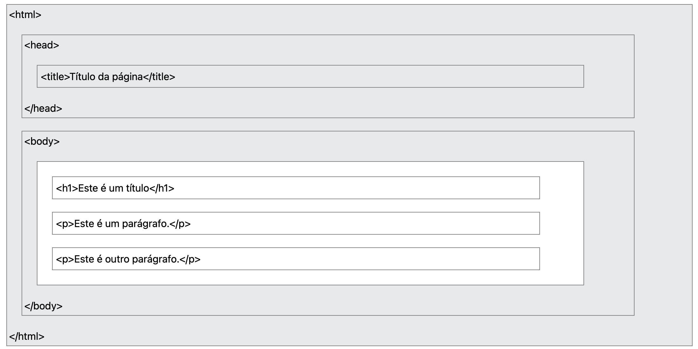
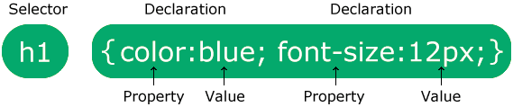

# Programação Web Front-End
*(Interface e interação do usuário)*

<!--
1. Programação web front-end. 
    1.1. Linguagens de scripting e controle de eventos: JavaScript e DOM. 
    1.2. Design responsivo. 
    1.3. Conceitos de SPA (Single Page Application).
-->
## Introdução

O uso de páginas web é frequente no nosso dia a dia. Com o uso de dispositivos móveis acessar uma página web ou um serviço web se tornou simples e rápido, de modo que hoje é quase impossível passar um dia inteiro sem acessar um site, ou um serviço diisponível na World Wide Web.

Diante desta crescente demanda, e da variedade de dispositivos que utilizam a rede mundial de computadores como forma de transmitir e enviar informação, é essencial compreender o funcionamento e processo de construção de páginas web. Neste texto serão abordadas as principais lingugaens de marcação, estilo e programação utilizadas para o desenvolviemtno de páginas web. O foco deste texto será o desenvolvimento _front-end_, que recebe esta nomeclatura devido a ser a parte que se preocupa com o que o usuário "visualiza", ou seja, este texto trabalhará com temas inerentes a criação de interface visual, estilização, e reações de páginas web.


## HTML

As páginas web utilizam o protocolo HTTP ( _Hiper Transfer Text Protocol_ ) para enviar e receber conteúdo, definições visuais, como: cores, posicionamento, tamanho e efeitos visuais. Hipertexto é um documento ou sistema formado por distintos blocos de informação (dados, textos, imagens, vídeos, sons) inetrligados por elos de associação. Cada um destes blocos de informação é chamado de lexia ou nó e representa o lugar onde o usuário/ leitor/ ouvinte do documento se encontra antes de seguir o caminho indicado pelo elo associativo. O termo 'elo' em inglês é 'link'.

O funcionamento de páginas web pode ser descrito da seguinte forma:
 
 * Um usuário abre o navegador e digita um endereço (URL ^[Uma URL é, basicamente, o endereço virtual de uma página ou website. A sigla tem origem na língua inglesa e significa "Uniform Resource Locator" (Localizador Uniforme de Recursos, em tradução livre). Por meio da URL, uma página que seria acessível apenas por uma sequência de números, pode ser convertida pelo sistema DNS.]);
 * Este endereço é requisitado ao servidor web via protocolo HTTP, que pode ser GET ou POST;
 * O servidor por sua vez responde enviando arquivos HTML e/ou outros que correspondem ao endereço solcitado;
 * O navehador recebe os arquivos e interpreta os conteúdos, scripts e folhas de estilo recebidos, gerando assim a visualização da página web no navegador do usuário que fez a solicitação. A world wide web surgiu no início dos anos 90, fruto das pequisas de Tim Berners-Lee, que possibilitaram, através do bowser (navegador), protocolo HTTP e lingugagem HTML, a localização e visualizaçào gráfica e textual do conteúdo da inetrnet nos computadores conectados.
 
 <!--
 Ver livro HTML/CSS 
 -->

### Sintaxe HTML

Assim como são necessárias linguagens de programação para o desenvolvimento de programas e aplicativos, também é necessária uma linguagem para criação de páginas de sites. Essa linguagem é denominada HTML (HyperText Markup Language, em português Linguagem de Marcação de Hipertexto). Porém, em vez de comandos para execução de cálculos ou processamento de dados, ela possui marcadores, conhecidos como tags, que são utilizados para formatar um texto, uma imagem ou qualquer outro objeto que faça parte da estrutura de um documento HTML.

A lingugaem de marcação de hipertexto (HTML) Esses marcadores são envolvidos pelos sinais `<` e `/>` para indicar o início e o fim da formatação, respectivamente, embora existam algumas exceções, como é o caso da tag `<br>`, utilizada para forçar a quebra de linhas de texto. A Código \@ref(fig:html) apresenta a sintaxe geral de um elemento HTML. A linguagem HTML não faz distinção entre letras maiúsculas e minúsculas na escrita das tags, ou seja, `<HTML>` e `<html>` são consideradas iguais.

Exemplo de sintaxe HTML apresnetado no código abaixo, onde elemento é o nome da tag, exemplo `<p>` tag de parágrafo que tem como tag de fechamento `</p`.

```{html, eval=FALSE}
<elemento> conteúdo do elemento </elemento>

```

Conforme apresentado na Figura \@ref(fig:html) todo documento HTML deve estar contido dentro da tag `<html>`, ou seja entre `<html>` e `</html>`. Dentro desta estrutura também é essencial definir a tag `<head>` que contém conteúdos importados, como folhas de estilo e metadados, além da tag `<title>` que define o nome da aba de exibição da página web no navegador. 

{width=60%}
Para documentos HTML, uma estrutura inicial comum é apresentada no código abaixo:
```{html, eval=FALSE}
<!DOCTYPE html>
<html lang="en">
<head>
    <meta charset="UTF-8">
    <meta name="viewport" content="width=device-width, initial-scale=1.0">
    <title>Document</title>
</head>
<body>
    
</body>
</html>
```

Note que o documento inicia com `<!DOCTYPE` `html>`. Esta declaração não é uma tag e sim uma "informação" para o navegador saber qual documento receberá. Na linha seguinte a tag `<html>` pode ser associada ao atributo global lang, exemplo: `lang="en" ` que identifica que a página exibirá conteúdo em língua inglesa. Para mais informações sobre a propriedade global de lingugagem acesse:  [https://developer.mozilla.org/pt-BR/docs/Web/HTML/Reference/Global_attributes/lang](https://developer.mozilla.org/pt-BR/docs/Web/HTML/Reference/Global_attributes/lang).

Dentro do elemento `<html>` temos minimamente dois elementos `<head>` e `<body>`. O elemento `<head>` não é renderizado para o usuário da página web, ele contém metadados que serão utilizados na renderização da página, como:

 * `<meta charset="UTF-8">` indica que o conjunto de caracteres que será utilizado para rendezizar a página. A W3school recomenda o uso do conjunto de caracteres "UTF-8" por, segundo a plataforma: "este conjunto representa quase todos os caracteres do mundo";
 * `<meta name="viewport" content="width=device-width, initial-scale=1.0">` é usado para controlar como a página é dimensionada em diferentes dispositivos.
 * `<title>` define o texto que será exibido na aba do navegador quando este arquivo HTML for visualizado.
 * Folhas de estilo (CSS), dentro do elemento `<head>` também é possível informar qual será a folha de estilos utilizada na renderização da página. Esta folha definirá cores, posicionamentos e alguns efeitos dos elementos da página.
 
 Dentro do elemento body está todo o conteúdo da página, Figuras, textos, links, vídeos, entre outros. Devido a variedade de conteúdos possíveis de exibição em uma página web, a gama de elementos possíveis em uma páagina web é grande. Veremos algumas das principais tags mais utilizadas e seus respectivos conteúdos.

Em uma pagina HTML idealmente todo conteúdo deve estar definido dentro de uma tag, isto por que queremos que os conteúdos disponibilizados sejam encontrados na rede. De modo geral buscas são realizdaas por meio de ferramentas como google, e essas ferramentas executam scripts de busca, que ranqueiam páginas web baseando-se no conetúdo que encontram. Desse modo é importante pensar como um script identifica um conteúdo. Sabe-se que as tags HTML são essênciais neste cenário. Vejamos como as tags HTML afetam os buscadores:

 * **Estrutura e significado:** Tags como `<title>`, `<h1>` a `<h6>` e `<strong>` dão aos buscadores informações sobre o título, os cabeçalhos e o conteúdo mais importante da página, o que ajuda a entender sua relevância.
 * **Informações de metadados:** As meta tags, inseridas na seção `<head>`, fornecem metadados sobre a página para os navegadores e buscadores. Exemplos incluem:
 * **`<title>`**: O título que aparece na aba do navegador e nos resultados de pesquisa.
 * **`<meta name="description" ...>`:** Um resumo do conteúdo da página que pode ser exibido nos resultados de busca.
 * **`<meta name="robots" ...>`:** Instruções para os robôs de busca sobre se a página deve ser indexada ( _index/noindex_ ) e se os links devem ser seguidos ( _follow/nofollow_ ).
 * **Imagens:** A tag `alt="texto alternativo"` (texto alternativo) descreve uma imagem. Essa tag é usada pelos buscadores para ranquear imagens em resultados de pesquisa, já que eles não conseguem "ver" as imagens.
 * **Otimização de busca pelo SEO ( _Search Engine Optimization_ )** : O uso adequado e semântico das tags é uma prática de SEO fundamental para melhorar o posicionamento de um site nos resultados de pesquisa. 
 
 Neste contexto veremos algumas tags essênciais no desenvolvimento de páginas web:
 
 * **Títulos**: os títulos (heads) são utilizados a partir das tags `<h1>` até `<h6>`, o elemento de tag `<h1>` é considerado o título que define a página, por isso em um site de notícias por exemplo é primordial destacar o título principal da notícia em uma tag h1. As tags h2 a h6 são consideradas subtítulos de h1. Exemplo: `<h1>Este é um título de nível 1</h1>`;
 * **Pargráfos e textos**: Para exibir um parágrafo de um texto livre a tag `<p>` é a mais recomendada, ela pode conter outras tags utilizadas para destacar palavras do texto, como as tags `<span>`: utilizada para formatar textos e que não associa nenhum sentido semantico ao texto nela contido; `<strong>` utilizada para indicar que uma palavra ou frase possui importância no contexto em que é apresentada.
 * **Listas:** Listas são estruturas para exibição de textos em formato de tópicos, também úteis para agrupar tópicos. Existem 3 tipos de tags para declaração de listas: listas não ordenadas `<ul>` e `</ul>`( _unordered list_); listas ordenadas `<ol>` e `</ol>` ( _ordered list_) e listas de definição `<dl>` e `</dl>`( _definition list_). Para listas ordenadas e não ordenadas cada item da lista deve ser definido com uma tag `<li>`  e `</li>` ( _list item_), no código abaixo apresentamos um exemplo de lista não ordeanda e não ordenada com maracdor quadrado(utlizando a propriedade type="square" na tag `<ul>`), uma lista ordenada com formato de núemros padrão (1, 2, 3, ... , n), e suas variações como algarismos romanos (utlizando a propriedade type="I" na tag `<ol>`), letras (utlizando a propriedade type="A" na tag `<ol>`);
 
```{html, eval=FALSE}
<!DOCTYPE html>
<html lang="pt-BR">
<head>
    <meta charset="UTF-8">
    <meta name="viewport" content="width=device-width, initial-scale=1.0">
    <title>Document</title>
</head>
<body>
    <p>1. Lista Não Ordenada</p>
    <ul>
        <li>Exemplo de item 1</li>
        <li>Exemplo de item 2</li>
    </ul>
    <p>2. Lista Ordenada, tipo 1, 2, 3 (padrão)</p>
    <ol>
        <li>Exemplo 1</li>
        <li>Exemplo 2</li>
    </ol>
    <p>3. Lista Ordenada, tipo A, B, C</p>
    <ol type="A">
        <li>Exemplo 1</li>
        <li>Exemplo 2</li>
    </ol>
    <p>4. Lista Ordenada, tipo I, II, III</p>
    <ol type="I">
        <li>Exemplo 1</li>
        <li>Exemplo 2</li>
    </ol>
</body>
</html>

```
    

   * **Tabelas**: Utilizadas para exibir informação em formato tabular, é construida utulizando-se a tag `<table>` e `</table>`. Cada linha da tabela deve ser definida pela tag `<tr>` e `</tr>` ( _table row_), dentre de cda linha as colunas são definidas com a tag `<td>` e `</td>`. Caso seja necessário é possível defnir um cabeçalho para a tabela com a tag `<thead>` e `</thead>`, cada coluna do cabeçaho é definida pela tag `<th>` e `</th>`. Neste contexto, recomenda-se que ao utiliar a tag `<thead>` e `</thead>` a tag `<tbody>` e `</tbody>` seja utilizada para a exibição da linha de dados da tabela. No exemplo abaixo apresento a contrução de uma tabela sem caçalho, a segunda tabela contém cabeçalho e body;
    

```{html, eval=FALSE}
<!DOCTYPE html>
<html lang="pt-BR">
<head>
    <meta charset="UTF-8">
    <meta name="viewport" content="width=device-width, initial-scale=1.0">
    <title>Document</title>
</head>
<body>
    <h1>Tabelas</h1>
    <p>Tabela sem cabeçalho</p>
    <table>
        <tr>
            <td>Nome</td>
            <td>E-mail</td>
        </tr>
        <tr>
            <td>Meu nome</td>
            <td>meuemail@email.com</td>
        </tr>
    </table>

    <p>Tabela com cabeçalho e corpo</p>
    <table>
        <thead>
            <th>Nome</th>
            <th>E-mail</th>
        </thead>
        <tbody>
            <tr>
                <td>Meu nome</td>
                <td>meuemail@email.com</td>
            </tr>
        </tbody>
    </table>
</body>
</html>

```

 * **Links**:  são tags utiizada para relacionar outras páginas web, ou até mesmo sub páginas do seu site, os links são declarados com o uso da tag `<a>` e `</a>`. Necessariamete define-se a propriedade href, como: `<a href="www.site.com.br">Clique aqui </a>`, neste exmeplo a página web exibirá o texto "Clique aqui" em formato de link, que ao ser clicado encaminhará o usuário para o endereço "www.site.com.br". O exemplo recarregará a guia do navegador exibindo então o endereço do link clicado, para exbir o endereço do link em uma nova guia o lindk deve ser definido com a propriedade `target="\_blank"`. Exemplo para link ser exibido em uma nova guia, sem fechar a gui de chamada `<a \ href="www.site.com.br" target="\_blank">Clique \ aqui </a>`.
 
```{html, eval=FALSE}
<!DOCTYPE html>
<html lang="pt-BR">

<head>
    <meta charset="UTF-8">
    <meta name="viewport" content="width=device-width, initial-scale=1.0">
    <title>Fromulários</title>
</head>

<body>
    <h1>Formulários html</h1>
    <div>
        <form name="formCadastro" action="3_enviadados.html">
            <h2 style="align-items: 'center';">Formulário de Cadastro - Versão 2</h2>
            <fieldset>
                <legend>| Identificação |</legend>
                <label for="txtNome">Nome:</label><input name="txtNome" maxlength="50" size="50" />
                <p><label for="txtRG">RG:</label><input name="txtRG" maxlength="15" size="15" />
                    <label for="txtCPF">CPF:</label><input name="txtCPF" maxlength="20" size="20" />
                </p>
            </fieldset>
            <fieldset>
                <legend>| Endereço |</legend>
                <label for="txtEndereco">Endereço:</label>
                <input name="txtEndereco" maxlength="50" size="50" placeholder="Logradouro"/>
                <input name="txtNumero" maxlength="8" size="8" placeholder="Número" type="number"/>
                <p><label for="txtBairro">Bairro:</label><input name="txtBairro" maxlength="40" size="40" /></p>
                <p><label for="txtCidade">Cidade:</label><input name="txtCidade" maxlength="40" size="40" /></p>
                <p><label for="cmbEstado">Estado:</label>
                    <select name="cmbEstado">
                        <option value="AC">Acre</option>
                        <option value="AL">Alagoas</option>
                        <option value="AM">Amazonas</option>
                        <option value="AP">Amapá</option>
                        <option value="BA">Bahia</option>
                        <option value="CE">Ceará</option>
                        <option value="DF">Distrito Federal</option>
                        <option value="ES">Espírito Santo</option>
                        <option value="GO">Goiás</option>
                        <option value="MA">Maranhão</option>
                        <option value="MG">Minas Gerais</option>
                        <option value="MS">Mato Grosso do Sul</option>
                        <option value="MT">Mato Grosso</option>
                        <option value="PA">Pará</option>
                        <option value="PB">Paraíba</option>
                        <option value="PE">Pernambuco</option>
                        <option value="PI">Piauí</option>
                        <option value="PR">Paraná</option>
                        <option value="RJ">Rio de Janeiro</option>
                        <option value="RN">Rio Grande do Norte</option>
                        <option value="RO">Rondônia</option>
                        <option value="RR">Roraima</option>
                        <option value="RS">Rio Grande do Sul</option>
                        <option value="SC">Santa Catarina</option>
                        <option value="SE">Sergipe</option>
                        <option value="SP">São Paulo</option>
                        <option value="TO">Tocantins</option>
                    </select>
                </p>
                <p><label for="txtTelefone">Telefone:</label><input name="txtTelefone" maxlength="20" size="20" /></p>
                <fieldset>
                    <legend>Sexo</legend>
                    <input type="radio" name="rbSexo" value="M">Masculino
                    <input type="radio" name="rbSexo" value="F">Feminino
                </fieldset>
                <fieldset>
                    <legend>Interesses</legend>
                    <input type="checkbox" name="chkComputacaoGrafica" value="CG" />Computação gráfica<br />
                    <input type="checkbox" name="chkLinguagens" value="LP" />Linguagem de programação<br />
                    <input type="checkbox" name="chkBancoDados" value="BD" />Banco de dados<br />
                    <input type="checkbox" name="chkRedes" value="RC" />Redes de computadores<br />
                    <input type="checkbox" name="chkEletronica" value="EL" />Eletrônica<br />
                    <input type="checkbox" name="chkDesenvolvimentoWeb" value="DW" />Desenvolvimento para web
                </fieldset>
            </fieldset>
            <br />
            <button type="submit">Enviar</button>
            <button type="reset">Recarregar</button>
        </form>
    </div>
</body>
</html>
``` 
 
 
 
 
 * **Formulários**:  são tags utiizada para a entrada de dados do usuário, exemplo: cadastro, pagamento, comentário. PAra criar um formulário todos os elementos devem ser declarados dentro entre `<form>` e `</form>`. A tag form possui algusn atributos importantes: **name**: define um nome para o formulário que ode ser utilizado por rotinas de script como Javascript; **action**: indica qual a ação ou página será executada quando a submissão do formulário; **method**: Define como os dados do formulário serão enviados, valores permitidos: "get" ou "post". O método **get** define que os dados do formulário serão enviados via URL, o método **post** encapsula os dados no corpo da mensagem e é considerado mais seguro. As tags de entrada de dados que devem ser utilizadas dentro de fromulários são geralmente `<input>` e devem ter suas propriedades `type`, `name`, `id` entre outras definidas, e todas devem idealemnete ser acompanhadas por uma `<label>`, tag que define o rótulo do campo de entrada. Exemplo: `<label for="txtRG">RG:</label>` exibe o texto "RG:" e esta relacionada ao campo de name "txtRG", o campo por sua fez é definido como segue: `<input \ type="text" \ name="txtRG" \ maxlength="15" \ size="15" >`.

## Folha de estilo CSS

As folhas de estilo CSS definem cor, posicionamento e tamanho dos elementos de uma página HTML e também podem ser manipuladas por scripts. A sigla CSS do inglês _Cascading Style Sheet_ tem esse nome devido ao comportamento defnido das folhas de estilo, uma vez que ao aplicar um estilo (cor, posicionamento, etc.) a um elemento HTML os elementos que estão aninhados dentro deste também receberão o estilo, além da característica de possibilidade de sobreposição de estilos. 

A sintaxe básica CSS é formada por `seletor \{ propriedade: valor \}`, conforme apresentado na imagem \@ref(fig:css), onde utiliza-se o seletor para elementos de título `h1`, aplica-se as propriedade de estilo: cor e tamanho de fonte, respectivamente azul e 12 pixels.

{width=40%}

É possível associar estilo escrito em CSS a uma página HTML de várias formas:

 * **Diretamente na tag do elemento ( _in-line_)**: Um exemplo possível seria alterar a cor de um título h1 para vermelho, diretamente na declaração deste elemento: `<h1 \ style="color:red;">Título \ alterado \ com \ a \ definição \ in-line</h1>`;
 * **Folha de estilos a parte**: Utilizando a tag `<style>` e `</style>` todos os comandos entre a tag de abertura e fechamento serão interpretados como comando de estilização CSS, por isso de modo geral esta tag é utilizada no início do código de página html, dentro da tag `<head>` , como o exemplo abaixo.

```{html, eval=FALSE}
<!DOCTYPE html>
<html lang="pt-BR">

<head>
    <meta charset="UTF-8">
    <meta name="viewport" content="width=device-width, initial-scale=1.0">
    <title>CSS</title>
    <style>
        p {
            font-family: Arial,Helvetica,sans-serif;
            color: blue;
            font-style: italic
        }
    </style>
    </head>
    <body>
        <h1>Exemplo de folha de estilo CSS</h1>
        <p>Método de definição interno</p>
    </body>
</html>
``` 


 * **Folha de estilos externa**: Utilizando a tag `<link \ rel="stylesheet" \ href="style.css">` dentro da tag `<head>`  todos os comandos escritos no arquivo style.css serão interpretados como comandos de estilização CSS. Exemplo:
 
```{CSS, eval=FALSE}
/* Arquivo style.css */
    
h1 {
    font-family: times new roman;
    font-size: 40px;
    font-weight: bold;
    font-style: italic;
    color: blue
}

h2 {
    font-family: helvetica;
    font-size: 25px;
    font-style: italic;
    color: red
}

p {
    font-family: arial;
    font-size: 16px;
    color: #990000
}

```

**Seletores CSS **

A sintaxe do CSS permite aplicar várias propriedades de estilo a um mesmo elemento, como vimos anteriormente o elemento parágrafo `<p>` descrito apenas como `p` no arquivo .css recebeu estilização em sua fonte, tamanho da fonte e cor, é importante lembrar que utilizando o CSS como apresentado, todos os parágrafos da página receberão esta estilização. 

Porém em algumas situações pode ser necessário repetir comandos CSS para vários elementos diferentes, por exemplo, se quisermos que os paragrafos e os elementos de título nível 2 `<h2>` exibem o texto na cor vermelha ( _red_)? Uma teriamos que escrever algo como:

```{CSS, eval=FALSE}
p{
    color: red;
}

h2{
    color: red;
}
```

Para solucionar estas e outras situações recorrentes no desenvolvimento de páginas web existem 3 tipos de seletores:

 * Seletores de elementos: que aplicam estilo a todos os elementos da página e de modo geral seu nome é o mesmo que de uma tag html, como no exemplo exibido anteriormente;
 * Seletores de classe: podem ser aplicados a vários elementos HTML, são definidos com '.' + 'nome' e solucuionam o problema anteriormente apresentado. Porém é necessário declarar qual classe afeta o elemento HTML utilizando a propriedade class, isto no docuemnto HTML, vejamos um exemplo onde a classe _minhaClasse_ é definida no arquivo CSS (estilo.css) e os elementos `h1` e `p` recebem a mesma classe (ou seja, o mesmo estilo CSS). 
 
 
```{CSS, eval=FALSE}
/* Arquivo estilo.css */
.minhaClasse {
    color: green;
}

```

Vejamos como a classe `minhaClasse` é aplicada no HTML. O resultado é que os elementos HTML que recebem a propriedade `class="minhaClasse"` (nome da classe sem o ponto) exibirão o texto na cor verde, conforme definido no arquivo 'estilo.css'.

```{html, eval=FALSE}
<!-- Arquivo index.html -->
<!DOCTYPE html>
<html lang="pt-BR">
<head>
    <meta charset="UTF-8">
    <meta name="viewport" content="width=device-width, initial-scale=1.0">
    <title>CSS</title>
    <link rel="stylesheet" type="text/css" href="estilo.css">
    </head>
    <body>
        <h1 class="minhaClasse">Exemplo de folha de estilo CSS</h1>
        <p class="minhaClasse">Método de definição interno</p>
    </body>
</html>
``` 

 * Seletores de elementos: são seletores que afetam o estilo de apenas um elemento (isto por que idealmente uma página web não deve conter mais de um elemento com o mesmo valor na propriedade id). PAra definir um seletor de elementos no CSS utiliza-se o símbolo de hashtag '#'. Vamos acrescentar um seletor de elementos ao exemplo anterior:
 
 
 
```{CSS, eval=FALSE}
/* Arquivo estilo.css */
.minhaClasse {
    color: green;
}

#novo{
    font-family: arial;
}
```

Vejamos como o id `novo` é aplicada no HTML. O resultado é que o elemento HTML que receber a propriedade `id="novo"` exibirá o texto com a fonte arial, conforme definido no arquivo 'estilo.css'.

```{html, eval=FALSE}
<!-- Arquivo index.html -->
<!DOCTYPE html>
<html lang="pt-BR">
<head>
    <meta charset="UTF-8">
    <meta name="viewport" content="width=device-width, initial-scale=1.0">
    <title>CSS</title>
    <link rel="stylesheet" type="text/css" href="estilo.css">
    </head>
    <body>
        <h1 class="minhaClasse">Exemplo de folha de estilo CSS</h1>
        <p class="minhaClasse">Método de definição interno</p>
        <p id="novo">Estelemento tem o id novo </p>
    </body>
</html>
``` 
 
 * Associação de seletores: Também é possível combinar seletores de elemento e classe, por exemplo, para que somente alguns elementos de determinada classe recebam uma estilização. Digamos que em um site de vendas você queira adicionar a cor de fundo amarela apenas a elementos de parágrafo marcado com a classe CSS 'promo'. No arquivo CSS você deve definir `elemento.classe` que neste caso seria como apresentado no exemplo de xódigo CSS abaixo, onde elemento é `p` e classe é `promo`.

```{CSS, eval=FALSE}
/* Arquivo estilo.css */

p.promo {
    background-color: yellow;
}

```

No HTML (apresentado abaixo), temos 3 parágrafos. Apenas os parágrafos marcados com a `class="promo"` serão exibidos com o fundo de texto amarelo.

```{html, eval=FALSE}
<!-- Arquivo index.html -->
<!DOCTYPE html>
<html lang="pt-BR">
<head>
    <meta charset="UTF-8">
    <meta name="viewport" content="width=device-width, initial-scale=1.0">
    <title>CSS</title>
    <link rel="stylesheet" type="text/css" href="estilo.css">
    </head>
    <body>
        <h1>Exemplo de folha de estilo CSS</h1>
        <p class="promo">Estelemento de promoção</p>
        <p>Elemento que não esta na promoção</p>
        <p class="promo">Estelemento de promoção</p>
    </body>
</html>
``` 

 * Seletores hierárquicos: A criação de um seletor filho se dá com o uso da seguinte sintaxe: `elemento\_pai>elemento_filho \{ propriedade: valor \};`, também é possível atribuir CSS via seletores descendentes, seguindo a mesma regra do seletor filho, porém sem o operador `>`, conforme o exemplo: `table \ i \ \{font-family:times \ new \ roman;\}`
 
**Layout Responsivo**
 
Nos primórdios do web design, páginas eram criadas para serem visualizadas em um tamanho de tela específico. Se o usuário tivesse uma tela maior ou menor do que o esperado, os resultados iam de barras de rolagem indesejadas, tamanhos de linha excessivamente longos e uso inadequado do espaço. À medida que diferentes tamanhos de tela foram aparecendo, surgiu o conceito de web design responsivo (RWD), um conjunto de práticas que permite que páginas da Web alterem seu layout e aparência para se adequarem a diferentes larguras, resoluções, etc. É uma ideia que mudou a forma de como projetamos para a Web com múltiplos dispositivos.

**Medidas relativas**


Ems (em)

Nossa primeira unidade relativa é bastante famosa no mundo CSS. Dificilmente você achará algum navegador que não tenha suporte para essa medida, que está presente desde os primórdios. Até para o IE, nós teríamos que usar a versão abaixo da 3.0 para que tivéssemos algum problema.

Esse definitivamente é um dos pontos que fazem o em tão popular. O segundo ponto, com certeza se dá a facilidade de criar layouts fluídos e responsivos.
Acima, temos uma div pai onde estou definindo um font-size de 16px, dentro dessa div, temos uma única div filha. Como havia mencionado, o tamanho definido para a fonte impactará no em dos elementos filhos.

```{html, eval=FALSE}
<style>
    #pai{
        font-size: 16px;
    }
    #filho{
        font-size: 2em;
    }
</style>
<div id="pai">
    div pai
    <div id="filho">
        div filho
    </div>
</div>
```

Nesse nosso caso, para a div mais interna (id=filho), 1em será igual a 16px, seguindo a lógica, 2em será igual a 32px e assim por diante. Podemos colocar valores como 1.5 também! Nesse nosso caso, 1.5em será igual a 24px Quando expressamos tamanhos como margin, padding utilizando em, isso significa que eles serão relativos ao tamanho da fonte do elemento pai.

Portanto, de acordo com o tamanho da fonte utilizada em determinado elemento, os elementos filhos serão redimensionados de forma a obedecer a referência a esse tamanho de fonte!

Uma técnica bastante utilizada consiste justamente em fazer uso desse poder do em componentizando nossos elementos. A ideia é que a alteração do tamanho da fonte do elemento pai faça com que todo o componente se modifique e redimensione baseando-se nesse novo valor.


O último ponto que devemos nos atentar ao usar o em é que quando usamos essa medida, nós temos que considerar o font-size de todos os elementos pai. Por exemplo, se tivéssemos uma terceira div mais interna no nosso exemplo anterior e definirmos o tamanho da fonte para 2em, nesse caso esses 2em seriam 64px, uma vez que o font-size do elemento pai foi definido sendo 32px(2em)! Pegou o pulo do gato?

Isso tende a se complicar quando estamos falando de 5, 6, 7 divs aninhadas, provavelmente não será muito divertido calcular isso! Mas a boa notícia é que temos uma unidade que nos ajuda a resolver esse probleminha.

**Rems (rem, "root em")**


O REM vem como sucessor do EM e ambos compartilham a mesma lógica de funcionamento (font-size), porém a forma de implementação é diferente. Enquanto o em está diretamente relacionado ao tamanho da fonte do elemento pai, o rem está relacionado com o tamanho da fonte do elemento root (raiz), no caso, a tag.

O fato de que o rem se relaciona com o elemento raiz resolve aquele problema que tínhamos com diversas divs (elementos) aninhados, uma vez que não haverá essa "herança" de tamanhos, lembra?! Ou seja, não precisaremos ter dor de cabeça tendo que realizar cálculos, uma vez que nos baseamos na tag raiz.

Exemplificando, sabemos que a tag html é a tag raiz de todo documento html. Dito isso, se definirmos que o font-size desse elemento será de 18px, então 1rem = 18px, 2rem = 36px e assim por diante... Normalmente os browsers especificam o tamanho default da fonte do elemento root (raiz) sendo 16px, então guarde isso no coração! Mesmo essa unidade sendo mais tranquila de se trabalhar, ela não era muito utilizada para design responsivo, o que de primeira pode soar um tanto quanto estranho...

O motivo para isso é o suporte para essa medida. O chrome e o firefox suportavam tranquilamente, assim como o Opera e o Safari, porém, antigamente grande parte dos usuários utilizavam o IE, mais específicamente o IE 8, e esse browser não lidava muito bem com os rems, isso fazia com que os desenvolvedores precisassem optar por alguma unidade diferente, em muitos casos, o próprio em.

Como disse acima, o valor base é 16px, e isso pode acabar gerando dificuldades para que encontremos alguns tamanhos padrões que costumam ser utilizados. Por exemplo, como faríamos para atingir um tamanho de 10px utilizando rem? Precisamos calcular.

**Vw (viewport width)**

Essa medida faz parte das medidas mais atuais e do futuro do CSS. Viewport units.

Como escrito no título, vw significa viewport width, mas o que é viewport?

Viewport nada mais é que a área visível de uma página web para o seu usuário, essa viewport pode variar de acordo com o dispositivo, sendo menor em celulares e maior em desktops.

Antigamente, quando não existiam tablets e celulares capazes de acessar sites, todas as web pages eram pensadas para a tela de um computador, com tamanho fixo e design estático. Com a chegada desses dispositivos móveis, essas páginas eram grandes demais para serem exibidas nesses aparelhos, o que tornava muito difícil a navegação.

A primeira solução partiu dos browsers desses dispositivos, eles adotavam um comportamento de retirar o zoom de forma que o site inteiro coubesse na tela do aparelho,definitivamente não era o ideal, mas uma solução rápida. No HTML5, foi introduzido uma maneira para que os desenvolvedores conseguissem alterar a viewport através da tag, corrigindo esse problema de usabilidade relacionado aos dispositivos móveis, mas isso é assunto para outra postagem!

Voltando para o nosso querido vw, essa unidade se relaciona diretamente com a largura da viewport, onde 1vw representa 1% do tamanho da largura dessa área visível. A diferença entre vw e a % é bem semelhante a diferença entre em e rem, onde a % é relativa ao contexto local do elemento e o vw é relativo ao tamanho total da largura da viewport do usuário.

Vh (viewport height)
Essa unidade funciona da mesma forma que o vw, porém dessa vez, a referência será a altura e não a largura. Existem diversos exemplos práticos e interessantes de uso dessas duas unidades. Você pode ver alguns usos nesse link, provavelmente mais para frente postarei alguns exemplos bacanas. Me cobrem!

**Vmin (viewport minimun)**

Essa unidade também se relaciona com as dimensões da viewport, mas com um porém. Anteriormente quando vimos vh e vw precisávamos escolher se gostaríamos de nos basear na altura (vh) ou na largura (vw) da viewport.

Diferentemente das anteriores, o vmin utilizará como base a menor dimensão da viewport (altura x largura), vamos ao exemplo.

Imagine que estamos trabalhando com uma viewport de 1600px de altura e 900px de largura. Nesse caso, 1vmin terá o valor de 9px (1% da menor dimensão!), caso tenhamos 100vmin, esse será igual a 900px! Interessante né?

No caso acima, a menor dimensão foi a da largura, porém se tivéssemos 300px para altura e 1400px para largura, nosso valor de referência seria o 300px! Sempre a menor dimensão!


**Layout (Flexbox e grid)**


## JavaScript

Introdução a JavaScript, com base no livro [@Flanagan2025], o JavaScript é a linguagem de programação da Web. A maioria dos sites modernos utiliza JavaScript, e todos os navegadores modernos – em computadores de mesa, consoles de jogos, tablets e smartphones – incluem interpretadores JavaScript, tornando-a a linguagem de programação mais amplamente distribuída da história. 

Ao longo da última década, o Node.js possibilitou a programação com JavaScript em ambientes diferentes dos navegadores Web, e o sucesso do Node indica que JavaScript agora também é uma das linguagens de programação mais utilizada entre os desenvolvedores de software. JavaScript é uma linguagem de alto nível, interpretada, apropriada para estilos de programação orientados a objetos e funcionais. As variáveis de JavaScript são não tipadas. Sua sintaxe é vagamente baseada na linguagem Java, exceto por este fato, não há outra relação entre as duas. JavaScript deriva suas funções de primeira classe de Scheme e da herança baseada em protótipos de Self, uma linguagem de programação pouco conhecida. 
Na verdade, o nome "JavaScript" é enganoso. A não ser pela semelhança sintática superficial, JavaScript é completamente diferente da linguagem de programação Java. E JavaScript já deixou para trás suas raízes como linguagem de script há muito tempo, tornando-se uma linguagem de uso geral robusta e eficiente, adequada para engenharia de software séria e projetos com grandes bases de código.


**JavaScript: história**


JavaScript foi criada na **Netscape** na fase inicial da Web e, tecnicamente, "JavaScript" é marca registrada, licenciada pela Sun Microsystems (agora Oracle), usada para descrever a implementação da linguagem pelo Netscape (agora Mozilla). A Netscape enviou a linguagem para a _European Computer Manufacturer’s Association_ (ECMA) para padronização e, devido a questões relacionadas à marca registrada, a versão padronizada manteve o nome estranho "ECMAScript". Na prática, todo mundo simplesmente chama a linguagem de JavaScript. Este livro usa o nome "ECMAScript" e a abreviatura "ES" para se referir ao padrão da linguagem e a versões desse padrão.

Entre 2010 e 2020, a versão 5 do padrão ECMAScript foi suportada por todos os navegadores Web. A ES6 foi lançada em 2015 e adicionou novos recursos importantes (incluindo a sintaxe de módulos e classes) que transformaram JavaScript, antes uma linguagem de scripts, em uma linguagem de programação de propósito geral séria, adequada para engenharia de software em larga escala. Desde a ES6, a especificação ECMAScript passou a adotar uma cadência de lançamento anual, e as versões da linguagem (ES2016, ES2017, ES2018, ES2019 e ES2020) hoje são identificadas pelo ano de lançamento.

À medida que JavaScript evolui, os projetistas da linguagem tentam corrigir falhas das versões anteriores (pré-ES5). Para manter a compatibilidade reversa, não é possível remover recursos legados, por mais falhos que sejam. Mas na ES5 e em versões posteriores, os programas podem optar pelo modo restrito do JavaScript, no qual diversos erros de versões anteriores da linguagem foram corrigidos.  


Para ser útil, toda linguagem deve ter ou uma plataforma ou uma biblioteca padrão para fazer coisas como entrada e saída básicas. A linguagem JavaScript básica define uma API mínima para trabalhar com números, texto, arrays, conjuntos, mapas e assim por diante, mas não inclui funcionalidade alguma de entrada ou saída. Entrada e saída (da mesma forma que recursos mais sofisticados, como conexão em rede, armazenamento e gráficos) são responsabilidade do "ambiente hospedeiro" dentro do qual JavaScript está incorporada.
O ambiente hospedeiro original de JavaScript era um navegador Web, e este ainda é o ambiente de execução mais comum para código JavaScript. O ambiente de navegador permite que o código JavaScript obtenha entrada do usuário por meio de mouse e teclado, além de fazer requisições HTTP. Ele também permite que o código JavaScript exiba saídas para o usuário usando HTML e CSS.

Fonte: [@Flanagan2025].

 
**Testando código**

A forma mais fácil de testar códigoJavaScript é abrir as ferramentas do desenvolvedor do seu navegador Web (com F12, Ctrl-Shift-I ou Command-Option-I) e selecionar a guia Console. Assim, você pode inserir o código na linha de prompt e ver os resultados enquanto digita. As ferramentas do desenvolvedor aparecem como painéis na parte inferior ou direita da janela do navegador, mas alguns navegadores permitem abri-las como janelas separadas. Outra forma de testar código JavaScript é baixar e instalar o Node do endereço [https://nodejs.org](https://nodejs.org). Após instalar o Node, você pode simplesmente abrir uma janela do Terminal e digitar **node** para iniciar uma sessão de JavaScript.
 
Se usar o Node de forma não interativa, ele não exibirá automaticamente todo o código que você executar, então será preciso que você faça isso. Para exibir mensagens e valores na janela do terminal ou na console de ferramentas do desenvolvedor de um navegador, você pode utilizar a função `console.log()`. Assim, por exemplo, se criar um arquivo `hello.js` contendo a seguinte linha de código:

```{js, eval=FALSE}
// Arquivo hello.js
    console.log("Hello World!");
```

e executar o arquivo com `node hello.js`, você verá a mensagem "Hello World!" reproduzida.
Se quiser ver a mesma mensagem reproduzida na console JavaScript de um navegador Web, crie um novo arquivo `hello.html` e insira o seguinte texto nele:

```{HTML, eval=FALSE}
<!-- Arquivo hello.html -->
<script src="hello.js"></script>
```

A seguir carregue `hello.html` no seu navegador Web usando o botão direito do mouse sobre o arquivo selecione "Abrir com..." e escolha um navegador web de sua preferência. Abra a janela ferramentas do desenvolvedor para ver a saudação na console.

**DOM**

Um dos objetos mais importantes na programação JavaScript do lado do cliente é o objeto Document, que representa o documento HTML exibido na janela ou guia do navegador. A API para trabalhar com documentos HTML é conhecida pelo nome Modelo de Documento por Objetos (DOM, do inglês Document Object Model). Mas o DOM é tão fundamental para a programação JavaScript do lado do cliente que merece ser apresentado aqui.
Os documentos HTML contêm elementos HTML aninhados uns dentro dos outros, formando uma árvore. Considere o seguinte documento HTML simples:

```{html, eval=FALSE}
<html>
  <head>
    <title>Sample Document</title>
  </head>
  <body>
    <h1>An HTML Document</h1>
    <p>This is a <i>simple</i> document.
  </body>
</html>
```

A tag de nível superior `<html>` contém tags `<head>` e `<body>`. A tag `<head>` contém uma tag `<title>`. E a tag `<body>` contém tags `<h1>` e `<p>`. As tags `<title>` e `<h1>` contêm strings de texto e a tag `<p>` contém duas strings de texto com uma tag `<i>` entre elas.

A API do DOM reflete a estrutura em árvore de um documento HTML. Para cada tag HTML no documento, há um objeto Element de JavaScript correspondente, e para cada bloco de texto no documento, há um objeto Text correspondente. As classes Element e Text, assim como a classe Document em si, são subclasses da classe Node mais geral, e objetos Node são organizados em uma estrutura de árvore que JavaScript consegue consultar e percorrer usando a API do DOM.

**Eventos**

Os programas JavaScript do lado do cliente usam um modelo de programação dirigido por eventos assíncronos. Nesse estilo de programação, o navegador Web gera um evento onde acontece algo interessante no documento, no navegador ou em algum elemento ou objeto associado a ele. Por exemplo, o navegador Web gera um evento quando termina de carregar um documento, quando o usuário coloca o cursor do mouse sobre um hiperlink ou quando pressiona uma tecla no teclado. Se um aplicativo JavaScript se interessa por um tipo de evento em especial, pode registrar uma ou mais funções para serem chamadas quando ocorrerem eventos desse tipo. Note que isso não é exclusividade da programação para Web: todos os aplicativos com interfaces gráficas com o usuário são projetados dessa maneira – não fazem nada até que algo aconteça (i.e., esperam que eventos ocorram) e, então, respondem.
Em JavaScript do lado do cliente, podem ocorrer eventos em qualquer elemento dentro de um documento HTML, e este fato faz o modelo de evento dos navegadores Web ser significativamente mais complexo do que o modelo de evento do Node. Começamos esta seção com algumas definições importantes que ajudam a explicar esse modelo de evento:

**Tipo de evento**

O tipo de evento é uma string que especifica o evento ocorrido. O tipo "mousemove", por exemplo, significa que o usuário moveu o mouse. O tipo "keydown" significa que uma tecla foi pressionada no teclado. E o tipo "load" significa que um documento (ou algum outro recurso) acabou de ser carregado da rede. Como o tipo de um evento é apenas uma string, às vezes ele é chamado de nome do evento e, de fato, usamos esse nome para identificar o tipo de evento específico sobre o qual estamos falando.

**Alvo do evento**

O alvo do evento é o objeto no qual o evento ocorreu ou ao qual o evento está associado. Quando falamos de um evento devemos especificar tanto o tipo como o alvo. Um evento load em um objeto Window, por exemplo, ou um evento click em um objeto Element `<button>`. Os objetos Window, Document e Element são os alvos de evento mais comuns nos aplicativos JavaScript do lado do cliente, mas alguns eventos são disparados em outros tipos de objetos. Por exemplo, um objeto Worker (um tipo de thread, abordado na Seção 15.13) é um alvo para eventos "message" que ocorrem quando a thread worker envia uma mensagem para a thread principal.

**Manipulador de evento ou ouvinte de evento** 

Esta função manipula ou responde a um evento[NT]. Os aplicativos registram suas funções de tratamento de evento no navegador Web, especificando um tipo e um alvo de evento. Quando ocorre um evento do tipo especificado no alvo especificado, o navegador chama a rotina de tratamento. Quando as rotinas de tratamento de evento são chamadas para um objeto, às vezes dizemos que o navegador "ativou", "disparou" ou "despachou" o evento. 

**Objeto evento**

Este é o objeto associado a um evento em especial e contém detalhes sobre esse evento. Os objetos evento são passados como argumento para a função de tratamento de evento. Todos os objetos evento têm uma propriedade type que especifica o tipo de evento e uma propriedade target que especifica o alvo do evento. Cada tipo de evento define um conjunto de propriedades para seu objeto evento associado. O objeto associado a um evento de mouse contém as coordenadas do cursor do mouse, por exemplo, e o objeto associado a um evento de teclado contém detalhes sobre a tecla que foi pressionada e sobre as teclas modificadoras que foram mantidas pressionadas. Muitos tipos de evento definem apenas algumas propriedades padrão – como type e target – e não transmitem muitas outras informações úteis. Para esses eventos é a simples ocorrência deles que importa e não os detalhes do evento.

**Propagação de eventos**

Este é o processo por meio do qual o navegador decide quais objetos disparam rotinas de tratamento de evento. Para eventos específicos de um objeto – como o evento "load" no objeto Window ou um evento "message" em um objeto Worker – não é exigida propagação alguma. Entretanto, quando certos tipos de eventos ocorrem nos elementos do documento HTML, eles se propagam ou "borbulham" para cima na árvore do documento. Se o usuário coloca o mouse sobre um hiperlink, o evento mousemove é primeiro ativado no elemento `<a>`  que define esse link. Em seguida, é ativado nos elementos contêineres: talvez um elemento `<p>`, um elemento `<section>` e o próprio objeto Document. Às vezes é mais conveniente registrar uma única rotina de tratamento de evento em um objeto Document ou em outro elemento contêiner do que registrar rotinas de tratamento em cada elemento individual em que você esteja interessado. Uma rotina de tratamento de evento pode interromper a propagação de um evento para que não continue a borbulhar e não dispare rotinas de tratamento nos elementos contêineres. As rotinas de tratamento fazem isso chamando um método do objeto evento. Em outra forma de propagação de eventos, chamada de captura de eventos, as rotinas de tratamento registradas especialmente em elementos contêineres têm a oportunidade de interceptar (ou "capturar") eventos antes que sejam entregues ao seu alvo. 

Alguns eventos têm ações padrão associadas. Quando ocorre um evento click em um hiperlink, por exemplo, a ação padrão é o navegador seguir o link e carregar uma nova página. As rotinas de tratamento de evento podem impedir essa ação padrão chamando um método do objeto evento. .

### Categorias de evento
JavaScript do lado do cliente suporta um número tão grande de tipos de evento que seria impossível abordar todos neste capítulo. Pode ser útil, no entanto, agrupar os eventos em algumas categorias gerais para ilustrar o escopo e a ampla variedade de eventos suportados:
Eventos de entrada dependentes de dispositivo
São os eventos diretamente ligados a um dispositivo de entrada específico, como o mouse ou o teclado. Eles incluem tipos de evento legados, como "mousedown", "mousemove", "mouseup", " _touchstart_", " _touchmove_", " _touchend_", " _keydown_" e " _keyup_."

**Eventos de entrada independentes de dispositivo**

São os eventos de entrada que não estão diretamente ligados a um dispositivo de entrada específico. O evento "click", por exemplo, indica que um link ou botão (ou outro elemento do documento) foi ativado. Isso é feito frequentemente por meio de um clique de mouse, mas também poderia ser feito pelo teclado ou (em dispositivos sensíveis ao toque) pelo gesto. O evento "input" é uma alternativa independente de dispositivo ao evento "keydown" e suporta entrada de teclado, assim como alternativas como recortar e colar e métodos de entrada usados para scripts ideográficos. Os tipos de evento "pointerdown", "pointermove" e "pointerup" são alternativas independentes de dispositivo a eventos de mouse e de toque. Eles funcionam para cursores do tipo mouse, telas touchscreen e entradas de estilo caneta óptica.

**Eventos de interface com o usuário**

Os eventos de interface com o usuário são de nível mais alto, frequentemente em elementos de formulário HTML que definem uma interface com o usuário para um aplicativo Web. Eles incluem o evento "focus" (quando um campo de entrada de texto recebe o foco do teclado), o evento "change" (quando o usuário altera o valor exibido por um elemento do formulário) e o evento "submit" (quando o usuário clica em um botão Submit em um formulário).

**Eventos de mudança de estado**

Alguns eventos não são disparados diretamente pela atividade do usuário, mas por atividade da rede ou do navegador, e indicam algum tipo de ciclo de vida ou mudança relacionada a estado. Os eventos "load" e "DOMContentLoaded", disparados nos objetos Window e Document, respectivamente, quando o documento está totalmente carregado, provavelmente são os mais usados desses eventos (consulte "Linha do tempo de JavaScript do lado do cliente" na página 420). Os navegadores disparam eventos "on-line" e "off-line" no objeto Window quando a conectividade de rede muda. O mecanismo de gerenciamento de histórico do navegador (Seção 15.10.4) dispara o evento "popstate" em resposta ao botão Back do navegador.

**Eventos específicos da API**

Várias APIs para a Web definidas por HTML e especificações relacionadas incluem seus próprios tipos de evento. Os elementos <video> e <audio> de HTML definem uma longa lista de tipos de evento associados, como "waiting", "playing", "seeking", "volumechange" etc., e podem ser usados para customizar a reprodução de mídia. Em termos gerais, APIs de plataformas Web que são assíncronas e que foram desenvolvidas antes de Promises serem adicionadas a JavaScript são baseadas em eventos e definem eventos específicos à API. A API IndexedDB, por exemplo (Seção 15.12.3), dispara eventos "success" e "error" quando solicitações de banco de dados dão certo ou dão errado. E embora a nova API fetch() para fazer pedidos HTTP seja baseada em Promises, a API XMLHttpRequest que ela substitui define diversos tipos de evento específicos à API.


**SPA – Single Page Application**

Chamamos de single page application (SPA) as aplicações web em que o usuário interage com uma única página. Esta página tem as informações de seu body dinamicamente reescritas para exibir informação atualizada.

Uma vez baixada a Single Page Application, o arquivo da página conterá as informações de HTML, JavaScript e CSS para responder a todas as possíveis interações do usuário, necessitando apenas receber do servidor o conteúdo a ser exibido.

Quando o usuário envia uma solicitação ao web server, os dados recebidos são utilizados para atualizar componentes da página do app com a nova informação. Essa comunicação é feita através de uma API, como XMLHttpRequest ou Fetch.

Interagir com uma Single Page Application traz uma sensação de unidade e fluidez à experiência de usuário, comparável àquela encontrada em apps nativos — um notório ganho em Experiência do Usuário.

**Vantagens das SPAs**

Para os produtos pouco afetados pelas limitações de uma aplicação Single Page, as vantagens trazidas por este tipo de implementação são bastante interessantes. Confira:

Performance: após o carregamento inicial, o tráfego de dados entre o servidor e o usuário é bastante reduzido, pois a página contém todas as informações necessárias para exibir os dados enviados em pacotes padronizados e simplificados. O tamanho reduzido dos dados trafegados ajuda a garantir tempos de resposta baixos;
Experiência do Usuário: para o usuário, interagir com uma superfície persistente, porém dinâmica, oferece uma experiência de uso intuitiva e de baixa fricção. A persistência da superfície do app traz a sensação de coesão e imersão.
Além disso, permite que o usuário construa familiaridade com a interface rapidamente;
Data caching: uma vez que tenha sido baixada, a página pode ser armazenada no cache do navegador. Isso agiliza o carregamento da aplicação, pois é somente necessário solicitar o conteúdo atualizado ao server. Além disso, páginas armazenadas no cache podem funcionar offline a partir dos dados já recebidos;
Agilidade de desenvolvimento: SPAs são desenvolvidas em frameworks conhecidos e requerem menos trabalho de implementação e testes, já que se trata de uma única página. Pelo seu tamanho enxuto e por serem baseadas em frameworks muito populares, as SPAs não apresentam grandes desafios de debugging.
 

**Desvantagens**

Os mesmos fatores que tornam as SPAs uma escolha inteligente para muitas aplicações, também podem representar obstáculos. Confira:

SEO: como as SPAs atualizam a mesma página para exibir diversas informações, não é gerada uma URL para cada conteúdo. Sem URLs únicas, os mecanismos de busca não conseguem detectar ou indexar este conteúdo;
Tempo de carregamento: SPAs costumam ter um carregamento inicial ligeiramente mais lento do que páginas estáticas. Além da diferença no tamanho do arquivo, a quantidade de conteúdo a ser renderizado pode significar um tempo de carregamento maior, mesmo quando a página está armazenada no cache.
Também é importante lembrar que SPAs utilizam JavaScript, portanto, requerem que o usuário tenha o recurso habilitado em seu sistema.


📖 **Referências:**
ALVES (2021), FLANAGAN (2013), CRANE (2007), SILVA (2021)

---


<!--

All chapters start with a first-level heading followed by your chapter title, like the line above. There should be only one first-level heading (`#`) per .Rmd file.

## A section

All chapter sections start with a second-level (`##`) or higher heading followed by your section title, like the sections above and below here. You can have as many as you want within a chapter.

### An unnumbered section {-}

Chapters and sections are numbered by default. To un-number a heading, add a `{.unnumbered}` or the shorter `{-}` at the end of the heading, like in this section.
-->
