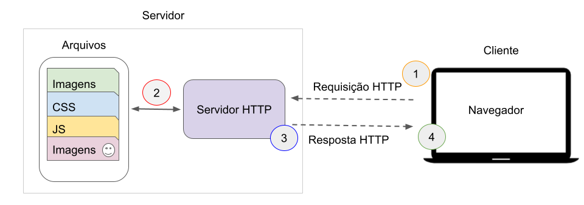

# Introdução à linguagem PHP

Nesta aula iniciaremos o estudo da linguagem **PHP**, uma das tecnologias mais utilizadas para desenvolvimento **web no lado do servidor**.

Até este momento da disciplina vocês trabalharam com **HTML, CSS e JavaScript**, tecnologias que executam diretamente no navegador. O PHP, por outro lado, é executado **no servidor**, permitindo criar páginas dinâmicas e aplicações web completas.

Segundo a documentação oficial da linguagem, PHP é uma linguagem de script open source amplamente utilizada e especialmente adequada para desenvolvimento web, podendo ser **embutida dentro do HTML**. :contentReference[oaicite:1]{index="1"}

------------------------------------------------------------------------

## Como funciona uma aplicação web

Aplicações web modernas são compostas por diferentes componentes que trabalham juntos para processar informações e entregar conteúdo ao usuário. De forma simplificada, uma aplicação web pode ser entendida como uma interação entre três elementos principais:

-   **Cliente**
-   **Servidor**
-   **Banco de dados**

Cada um desses componentes possui responsabilidades específicas dentro do funcionamento do sistema.

### Cliente {.unnumbered}

O **cliente** é o dispositivo utilizado pelo usuário para acessar a aplicação. Na maioria dos casos, o cliente é representado pelo **navegador web**, como Google Chrome, Firefox ou Edge.

No lado do cliente são executadas principalmente tecnologias como:

-   **HTML** – estrutura da página;
-   **CSS** – estilo e aparência visual;
-   **JavaScript** – interatividade e manipulação da interface.

Essas tecnologias são responsáveis por apresentar a interface ao usuário e capturar suas ações, como clicar em botões, preencher formulários ou navegar entre páginas.

Quando o usuário realiza alguma ação que exige processamento adicional (por exemplo, enviar um formulário ou solicitar dados), o navegador envia uma **requisição** para o servidor.

### Servidor {.unnumbered}

O **servidor** é responsável por receber as requisições enviadas pelo cliente, processar as informações e gerar uma resposta adequada.

No contexto desta disciplina, o processamento no servidor será realizado utilizando **PHP**. O código PHP é executado no servidor web (Apache, no caso do XAMPP) antes que a resposta seja enviada ao navegador.

O servidor pode realizar diversas tarefas, como:

-   processar dados enviados por formulários;
-   executar regras de negócio da aplicação;
-   acessar bancos de dados;
-   gerar conteúdo dinâmico;
-   validar informações enviadas pelo usuário.

Após processar a requisição, o servidor gera uma resposta — geralmente em formato **HTML** — que será enviada de volta ao navegador.

### Banco de dados {.unnumbered}

Muitas aplicações web precisam armazenar informações de forma persistente. Para isso, utilizam **bancos de dados**.

O banco de dados permite armazenar e consultar informações como:

-   usuários cadastrados;
-   produtos;
-   pedidos;
-   registros de atividades;
-   conteúdos da aplicação.

Durante a execução de uma aplicação web, o servidor pode consultar ou modificar dados armazenados no banco de dados. Essas operações normalmente são realizadas por meio de comandos específicos de consulta.

Na disciplina, a integração entre PHP e banco de dados será utilizada para construir aplicações capazes de armazenar e recuperar informações.

### Fluxo de funcionamento de uma aplicação web {.unnumbered}

O funcionamento básico de uma aplicação web pode ser representado pelo seguinte fluxo:

```{r fig-produtividade-emprego, echo=FALSE, fig.cap="Fluxo de uma página web. Fonte: https://jesielviana.gitbook.io/guiaweb."}

```

Esse processo ocorre de forma muito rápida e é repetido sempre que o usuário realiza alguma interação que exige processamento no servidor.

### Exemplo prático {.unnumbered}

Considere uma aplicação simples de cadastro de usuários.

1.  O usuário acessa uma página com um formulário de cadastro.
2.  O usuário preenche seus dados e envia o formulário.
3.  O navegador envia os dados ao servidor.
4.  O servidor executa um script PHP para processar as informações.
5.  O script PHP grava os dados no banco de dados.
6.  O servidor retorna uma mensagem confirmando o cadastro.
7.  O navegador exibe o resultado ao usuário.

Nesse processo:

-   o **cliente** envia os dados;
-   o **servidor** processa as informações;
-   o **banco de dados** armazena os registros.

### Papel do PHP nesse processo {.unnumbered}

Dentro da arquitetura de uma aplicação web, o PHP atua como intermediário entre o cliente e o banco de dados. Ele recebe as requisições do usuário, aplica a lógica da aplicação e gera o conteúdo que será exibido no navegador.

Ao longo desta disciplina, serão explorados diferentes aspectos dessa interação, incluindo:

-   criação de páginas dinâmicas em PHP;
-   processamento de formulários enviados pelo usuário;
-   organização da aplicação utilizando o padrão MVC;
-   integração com bancos de dados para armazenamento e consulta de informações.

Compreender esse fluxo é essencial para entender como aplicações web são construídas e como diferentes tecnologias trabalham juntas para entregar funcionalidades ao usuário.

## O papel do PHP no desenvolvimento web

Quando utilizamos apenas HTML, CSS e JavaScript, o navegador apenas exibe informações previamente definidas.

Com o PHP, o servidor pode:

-   processar dados enviados por formulários
-   acessar bancos de dados
-   gerar páginas dinamicamente
-   autenticar usuários
-   manipular arquivos
-   integrar APIs

O fluxo simplificado de uma aplicação PHP é:

```         

Navegador → Servidor Web → Script PHP → HTML gerado → Navegador
```

O navegador **nunca recebe o código PHP**, apenas o resultado gerado por ele.

------------------------------------------------------------------------

## PHP embutido em HTML

Uma característica importante do PHP é a possibilidade de inserir código PHP diretamente dentro de páginas HTML.

Exemplo:

``` php
<!DOCTYPE html>
<html>
<head>
<title>Exemplo PHP</title>
</head>

<body>

<?php
echo "Olá, eu sou um script PHP!";
?>

</body>
</html>
```

Neste exemplo:

-   HTML define a estrutura da página
-   PHP gera conteúdo dinamicamente

------------------------------------------------------------------------

## Onde o PHP pode ser utilizado

O PHP pode ser usado em três contextos principais:

### Scripts executados no servidor (Server-side) {.unnumbered}

Este é o uso mais comum do PHP.

Neste caso o servidor executa o código e envia o resultado ao navegador.

### Scripts de linha de comando {.unnumbered}

O PHP também pode ser executado diretamente no terminal:

```         
php script.php
```

Esse tipo de uso é comum para:

-   rotinas automáticas
-   processamento de arquivos
-   tarefas agendadas (cron jobs)

### Aplicações desktop {.unnumbered}

Embora não seja o uso mais comum, é possível desenvolver aplicações desktop com PHP utilizando bibliotecas como **PHP-GTK**.

------------------------------------------------------------------------

## Ambiente de execução

Para executar código PHP é necessário um **servidor web** com o interpretador PHP instalado.

Uma solução comum para ambientes de desenvolvimento é o **XAMPP**, que inclui:

-   Apache (servidor web)
-   PHP
-   MySQL/MariaDB
-   ferramentas administrativas

O procedimento básico para executar um script PHP é:

1.  iniciar o XAMPP
2.  iniciar o servidor Apache
3.  colocar os arquivos PHP na pasta:

```         
xampp/htdocs
```

4.  acessar o arquivo pelo navegador:

```         
http://localhost/pasta/arquivo.php
```

Diferentemente do HTML, o arquivo **não deve ser aberto diretamente no navegador**, pois precisa ser processado pelo servidor.

------------------------------------------------------------------------

## Estrutura básica de um script PHP

Todo código PHP deve estar dentro das tags especiais:

``` php
<?php

// código PHP

?>
```

Exemplo simples:

``` php
<?php
echo "Olá mundo!";
?>
```

------------------------------------------------------------------------

## Variáveis em PHP

Variáveis são usadas para armazenar informações na memória durante a execução do programa.

Em PHP:

-   todas as variáveis começam com `$`
-   não é necessário declarar o tipo da variável

Exemplo:

``` php
$nome = "Maria";
$idade = 20;
```

PHP é considerado uma linguagem **fracamente tipada**, pois o tipo da variável é determinado automaticamente.

------------------------------------------------------------------------

## Tipos de dados básicos

Alguns tipos de dados comuns em PHP incluem:

| Tipo    | Exemplo           |
|---------|-------------------|
| String  | "Olá mundo"       |
| Integer | 10                |
| Float   | 10.5              |
| Boolean | true ou false     |
| Array   | lista de valores  |
| Null    | ausência de valor |

Exemplo:

``` php
$nome = "Ana";
$idade = 25;
$altura = 1.70;
$ativo = true;
```

------------------------------------------------------------------------

## Descobrindo o tipo de uma variável

Podemos utilizar funções da linguagem para identificar o tipo de uma variável.

Exemplo:

``` php
echo gettype($nome);
```

Essa função retorna o tipo da variável em tempo de execução.

------------------------------------------------------------------------

## Exibindo informações na tela

O comando mais utilizado para imprimir dados em PHP é:

```         
echo
```

Exemplo:

``` php
echo "Olá mundo";
```

Também podemos exibir variáveis:

``` php
$nome = "Carlos";
echo $nome;
```

------------------------------------------------------------------------

## Concatenação de strings

Para juntar textos e variáveis utilizamos o operador `.`

Exemplo:

``` php
echo "Olá " . $nome;
```

Outra forma é utilizar aspas duplas:

``` php
echo "Olá $nome";
```

Exemplo completo:

``` php
$nome = "Carlos";
$idade = 30;

echo "Olá $nome, sua idade é $idade";
```

------------------------------------------------------------------------

## Comentários no código

Comentários são utilizados para documentar o código e facilitar sua compreensão.

Comentário de uma linha:

``` php
// comentário
```

ou

``` php
# comentário
```

Comentário de múltiplas linhas:

``` php
/*
comentário
em várias linhas
*/
```

------------------------------------------------------------------------

## Operadores matemáticos

PHP possui operadores matemáticos semelhantes aos utilizados em outras linguagens.

| Operador | Descrição        |
|----------|------------------|
| \+       | soma             |
| \-       | subtração        |
| \*       | multiplicação    |
| /        | divisão          |
| \%       | resto da divisão |
| \*\*     | potenciação      |

Exemplo:

``` php
$a = 10;
$b = 5;

echo $a + $b;
echo $a - $b;
echo $a * $b;
echo $a / $b;
```

------------------------------------------------------------------------

## Exemplos de operações

Soma:

``` php
$soma = 2 + 2;
echo "Resultado: $soma";
```

Divisão:

``` php
$divisao = 5 / 2;
echo $divisao;
```

Potência:

``` php
$potencia = 3 ** 2;
echo $potencia;
```

Resto da divisão:

``` php
$resto = 10 % 3;
echo $resto;
```

------------------------------------------------------------------------

## Comparação com outras linguagens

| Conceito     | C / Java  | PHP     |
|--------------|-----------|---------|
| variável     | int idade | \$idade |
| imprimir     | printf    | echo    |
| concatenação | \+        | .       |

------------------------------------------------------------------------

## Boas práticas iniciais

Algumas recomendações importantes ao programar em PHP:

-   utilizar nomes de variáveis descritivos
-   manter o código bem indentado
-   comentar trechos importantes
-   separar lógica de apresentação sempre que possível

------------------------------------------------------------------------

## Recebendo dados do usuário em PHP

Uma das principais funcionalidades do PHP em aplicações web é **receber e processar dados enviados pelo usuário**, normalmente por meio de **formulários HTML**.

Quando um usuário preenche um formulário e clica em um botão de envio, o navegador envia essas informações para o servidor. O PHP então recebe esses dados e pode utilizá-los para realizar cálculos, armazenar informações ou gerar respostas dinâmicas.

### Criando um formulário HTML {.unnumbered}

O envio de dados geralmente começa com um formulário HTML.

Exemplo:

``` html
<form method="post" action="processa.php">

Nome:
<input type="text" name="nome">

Idade:
<input type="number" name="idade">

<button type="submit">Enviar</button>

</form>
```

Elementos importantes do formulário:

-   `method` define o método de envio dos dados (`GET` ou `POST`)
-   `action` define qual arquivo PHP irá receber os dados
-   `name` identifica cada campo enviado ao servidor

### Recebendo dados no PHP {.unnumbered}

No arquivo indicado no `action` do formulário (`processa.php`, por exemplo), os dados podem ser acessados utilizando **variáveis superglobais** do PHP.

As mais utilizadas são:

-   `$_POST` → recebe dados enviados pelo método POST
-   `$_GET` → recebe dados enviados pela URL

Exemplo de processamento:

``` php
<?php

$nome = $_POST['nome'];
$idade = $_POST['idade'];

echo "Nome: $nome <br>";
echo "Idade: $idade";

?>
```

Neste exemplo:

-   o PHP acessa o valor do campo `nome`
-   o PHP acessa o valor do campo `idade`
-   os valores são exibidos na página

### Exemplo completo {.unnumbered}

Arquivo `index.html`:

``` html
<form method="post" action="dados.php">

Nome:
<input type="text" name="nome">

Idade:
<input type="number" name="idade">

<button type="submit">Enviar</button>

</form>
```

Arquivo `dados.php`:

``` php
<?php

$nome = $_POST['nome'];
$idade = $_POST['idade'];

echo "Olá $nome <br>";
echo "Sua idade é $idade";

?>
```

Quando o usuário envia o formulário:

1.  o navegador envia os dados ao servidor
2.  o PHP recebe os dados
3.  o PHP executa o script
4.  o resultado é exibido na página

### Validação básica {.unnumbered}

Antes de utilizar os dados recebidos, é importante verificar se os campos foram realmente preenchidos.

Exemplo simples:

``` php
<?php

if (empty($_POST['nome']) || empty($_POST['idade'])) {
    echo "Todos os campos devem ser preenchidos.";
} else {

    $nome = $_POST['nome'];
    $idade = $_POST['idade'];

    echo "Nome: $nome <br>";
    echo "Idade: $idade";
}

?>
```

Essa verificação evita erros quando o usuário envia o formulário com campos vazios.

## Exercícios

Desenvolva os seguintes exercícios utilizando PHP.

1.  Construir um algoritmo que leia dois números e efetue a soma.

-   Se o resultado da soma for maior que 10, apresentar o valor somado a 8.
-   Caso contrário, apresentar o valor subtraído de 5.

2.  Ler três números diferentes e exibi-los em **ordem decrescente**.
3.  Ler:

-   nome
-   gênero
-   idade Se a idade for maior que 25, imprimir:

```         
Nome: ...
Gênero: ...
Você pode se cadastrar
```

Caso contrário:

```         
Nome: ...
Gênero: ...
Você não pode se cadastrar
```

4.  Ler um número inteiro entre **1 e 12** e exibir o mês correspondente.

Exemplo:

```         
1 → Janeiro
2 → Fevereiro
...
```

Caso o número esteja fora do intervalo, informar que não existe mês correspondente.

------------------------------------------------------------------------

## Leituras recomendadas

BENTO, Evaldo. Desenvolvimento Web com PHP e MySQL.

SARAIVA, Maurício; BARRETO, Jeanine. Desenvolvimento de Sistemas com PHP.

Manual oficial da linguagem:

<https://www.php.net/manual/pt_BR>
