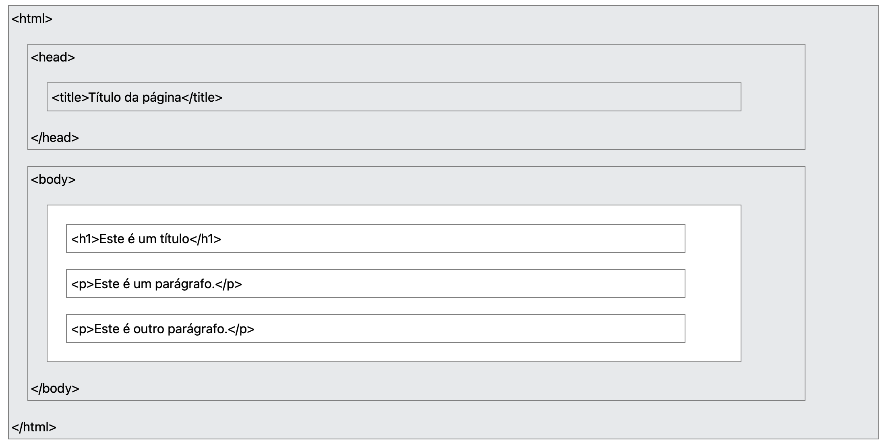
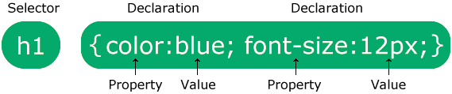
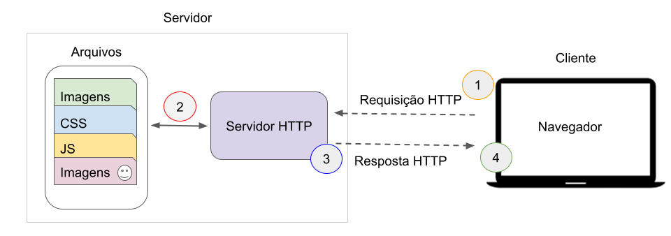

--- 
title: "Desenvolvimento de Sistemas"
author: "Juliana Costa Silva"
date: "2026-03-27"
site: bookdown::bookdown_site
documentclass: book
bibliography: [book.bib, packages.bib]
# url: your book url like https://bookdown.org/yihui/bookdown
# cover-image: path to the social sharing image like images/cover.jpg
description: |
  This is a minimal example of using the bookdown package to write a book.
  The HTML output format for this example is bookdown::bs4_book,
  set in the _output.yml file.
biblio-style: apalike
csl: chicago-fullnote-bibliography.csl
---

# Sobre

Este é um _e-book_ escrito em R **Markdown**. Sera utilizado como material de apoio da disciplina de Desenvolvimento de sistemas.

## Como utilizar este material

Este e-book foi elaborado como material de apoio para a disciplina e tem como objetivo complementar as aulas teóricas e práticas. Ao longo dos capítulos serão apresentados conceitos fundamentais do desenvolvimento web utilizando **PHP**, exemplos de código e atividades práticas que permitem aplicar os conteúdos estudados.

O material foi organizado de forma **progressiva**, partindo dos conceitos básicos da linguagem até tópicos mais estruturados utilizados no desenvolvimento de aplicações web completas. Dessa forma, recomenda-se que os capítulos sejam estudados **na ordem em que são apresentados**, pois muitos conceitos dependem de conteúdos discutidos anteriormente.

### Organização dos capítulos

Cada capítulo do material segue, em geral, a seguinte estrutura:

- **Apresentação do conceito** – introdução teórica do tema abordado;
- **Exemplos de código** – pequenos trechos de código que ilustram o funcionamento da linguagem;
- **Explicações passo a passo** – detalhamento de como o código funciona;
- **Atividades ou exercícios** – propostas de implementação para consolidar o aprendizado.

Os exemplos apresentados no texto foram pensados para serem executados diretamente no ambiente de desenvolvimento utilizado na disciplina.

### Aprendizado baseado em prática

A programação é uma habilidade que se desenvolve principalmente por meio da prática. Por esse motivo, é altamente recomendado que o estudante **não apenas leia o código apresentado**, mas também:

- reproduza os exemplos em seu próprio ambiente de desenvolvimento;
- modifique partes do código para observar diferentes comportamentos;
- implemente as atividades propostas ao final de cada capítulo.

A experimentação é parte fundamental do processo de aprendizagem em programação.

### Execução dos exemplos

Sempre que um exemplo de código for apresentado, recomenda-se que ele seja salvo como um arquivo PHP dentro da pasta de projetos utilizada na disciplina. Após salvar o arquivo, o estudante poderá executá-lo através do navegador, utilizando o servidor local configurado no ambiente de desenvolvimento.

Esse processo permite observar como o código PHP é executado no servidor e como o resultado é exibido no navegador.

### Relação com as aulas

Este material não substitui as aulas, mas funciona como um **guia de referência e estudo**. Durante as aulas serão apresentados exemplos adicionais, atividades práticas e discussões que complementam o conteúdo descrito no e-book.

Recomenda-se que os estudantes utilizem este material para:

- revisar conceitos discutidos em aula;
- consultar exemplos de código;
- apoiar a realização das atividades propostas;
- aprofundar o entendimento sobre os tópicos estudados.

### Evolução dos projetos

Ao longo da disciplina, os exercícios e exemplos irão evoluir gradualmente, permitindo que os estudantes passem de programas simples para estruturas mais organizadas de desenvolvimento, incluindo:

- uso de **programação orientada a objetos em PHP**;
- organização do código utilizando o padrão **Model-View-Controller (MVC)**;
- integração de aplicações com **bancos de dados**.

Essa progressão busca aproximar o estudante do modo como aplicações web reais são desenvolvidas.

### Recomendações de estudo

Para aproveitar melhor este material, recomenda-se:

- acompanhar os exemplos com o ambiente de desenvolvimento aberto;
- manter um repositório ou pasta organizada com os exercícios desenvolvidos;
- revisar regularmente os conceitos apresentados nos capítulos anteriores;
- buscar compreender não apenas *como* o código funciona, mas também *por que* ele foi estruturado daquela forma.

A combinação entre leitura, prática e experimentação permitirá desenvolver gradualmente as competências necessárias para a construção de aplicações web utilizando PHP.

<!--chapter:end:index.Rmd-->

# Apresentação da disciplina

O desenvolvimento de aplicações web modernas envolve a integração de diferentes tecnologias que atuam em camadas distintas de um sistema. Nas disciplinas iniciais de programação web, é comum que o estudante tenha contato com tecnologias voltadas ao **lado do cliente**, como HTML, CSS e JavaScript, responsáveis pela estrutura, apresentação e interação das páginas exibidas no navegador.

No entanto, muitas funcionalidades presentes em aplicações web reais dependem de processamento no **lado do servidor**, como autenticação de usuários, manipulação de dados, geração dinâmica de páginas e comunicação com bancos de dados. É nesse contexto que se insere o estudo de linguagens de programação voltadas ao **desenvolvimento back-end**.

Este material foi desenvolvido como apoio à disciplina e tem como objetivo introduzir os conceitos fundamentais para o desenvolvimento de aplicações web utilizando **PHP**. A linguagem PHP é amplamente utilizada na construção de sistemas web e possui um ecossistema consolidado que permite o desenvolvimento de aplicações robustas, escaláveis e integradas com diferentes tecnologias.

Ao longo deste e-book serão abordados os principais conceitos necessários para compreender o funcionamento de aplicações web baseadas em PHP. Inicialmente serão apresentados os fundamentos da linguagem, incluindo **sintaxe básica, variáveis, operadores, estruturas de controle e manipulação de dados**. Esses tópicos retomam conceitos estudados anteriormente em disciplinas de algoritmos e programação, agora aplicados ao contexto do desenvolvimento web.

Na sequência, o material introduz conceitos de **programação orientada a objetos em PHP**, explorando elementos como classes, objetos, encapsulamento e organização do código. A utilização da orientação a objetos é essencial para o desenvolvimento de aplicações mais organizadas e de maior porte.

Outro tema importante abordado nesta disciplina é o padrão arquitetural **Model-View-Controller (MVC)**, amplamente utilizado no desenvolvimento de aplicações web. Esse padrão permite separar responsabilidades dentro de um sistema, organizando o código em camadas responsáveis pela lógica de negócio, interface com o usuário e controle das requisições da aplicação.

Além disso, serão apresentados os fundamentos de **integração com bancos de dados**, permitindo que aplicações PHP possam armazenar, consultar e manipular informações persistentes. Essa etapa é essencial para a construção de sistemas reais, como cadastros de usuários, gerenciamento de produtos e outras aplicações baseadas em dados.

Para o desenvolvimento das atividades práticas será utilizado um ambiente composto por:

- **XAMPP**, responsável por fornecer o servidor web Apache, o interpretador PHP e o sistema gerenciador de banco de dados utilizados nas aulas;
- **Visual Studio Code (VSCode)**, utilizado como ambiente de desenvolvimento para edição e organização dos códigos.

Ao final da disciplina, espera-se que o estudante seja capaz de compreender o funcionamento básico de aplicações web desenvolvidas com PHP, implementar funcionalidades no lado do servidor, organizar projetos utilizando o padrão MVC e integrar suas aplicações com bancos de dados.

Este material foi elaborado como guia de apoio às aulas, contendo explicações conceituais, exemplos de código e atividades práticas que incentivam a experimentação e o desenvolvimento progressivo das habilidades necessárias para a construção de aplicações web.


## Ambiente de desenvolvimento utilizado na disciplina

Para o desenvolvimento das atividades práticas desta disciplina será utilizado um ambiente de desenvolvimento local composto por duas ferramentas principais: **XAMPP** e **Visual Studio Code (VSCode)**. Esse conjunto de ferramentas permite que os estudantes desenvolvam e executem aplicações PHP diretamente em seus computadores, simulando o funcionamento de um servidor web real.

### XAMPP

O **XAMPP** é um pacote de software que reúne diferentes componentes necessários para o desenvolvimento de aplicações web. Ele facilita a configuração do ambiente de servidor local, evitando a necessidade de instalar e configurar manualmente cada ferramenta separadamente.

Entre os principais componentes do XAMPP estão:

- **Apache** – servidor web responsável por processar requisições HTTP e executar scripts PHP;
- **PHP** – interpretador da linguagem utilizado para executar os códigos desenvolvidos;
- **MySQL/MariaDB** – sistema gerenciador de banco de dados utilizado para armazenar informações das aplicações;
- **phpMyAdmin** – ferramenta web utilizada para administração de bancos de dados.

Ao iniciar o Apache através do painel do XAMPP, o computador passa a funcionar como um **servidor web local**, permitindo que aplicações PHP sejam executadas e acessadas pelo navegador.

Por padrão, os arquivos da aplicação devem ser armazenados na pasta:

```

xampp/htdocs

```

Os projetos criados dentro dessa pasta podem ser acessados através do navegador utilizando o endereço:

```

[http://localhost/nome-da-pasta](http://localhost/nome-da-pasta)

```

Essa forma de acesso é importante porque o PHP precisa ser executado pelo servidor web antes de ser enviado ao navegador.

### Visual Studio Code (VSCode)

O **Visual Studio Code (VSCode)** será utilizado como editor de código durante a disciplina. Trata-se de um ambiente de desenvolvimento leve, gratuito e amplamente utilizado por profissionais da área de desenvolvimento web.

Entre as principais funcionalidades do VSCode destacam-se:

- destaque de sintaxe para diversas linguagens;
- autocompletar de código;
- organização de projetos em pastas;
- integração com controle de versão (Git);
- suporte a extensões que ampliam as funcionalidades do editor.

Durante as aulas, o VSCode será utilizado para:

- criar e editar arquivos PHP;
- organizar a estrutura dos projetos;
- visualizar e modificar arquivos HTML, CSS e JavaScript utilizados nas aplicações.

Para melhorar a experiência de desenvolvimento, recomenda-se a instalação de algumas extensões úteis para PHP, como:

- **PHP Intelephense**
- **PHP Debug**
- **Prettier ou similar para formatação de código**

### Estrutura básica de um projeto

Durante a disciplina, os projetos geralmente seguirão uma estrutura simples dentro da pasta `htdocs`, por exemplo:

```

htdocs
└── projeto-aula
├── index.php
├── css
│   └── estilo.css
├── js
│   └── script.js
└── views

```

Essa organização facilita a separação entre diferentes tipos de arquivos utilizados na aplicação.

### Fluxo de desenvolvimento utilizado nas aulas

De forma geral, o processo de desenvolvimento durante as atividades práticas seguirá os seguintes passos:

1. Criar a pasta do projeto dentro da pasta `htdocs`;
2. Abrir a pasta do projeto no VSCode;
3. Criar ou editar arquivos PHP;
4. Iniciar o servidor Apache no XAMPP;
5. Acessar a aplicação pelo navegador através do endereço `localhost`.

Esse fluxo permite desenvolver, testar e modificar aplicações rapidamente durante as aulas, facilitando o aprendizado prático dos conceitos apresentados na disciplina.

<!--chapter:end:01-intro.Rmd-->

# Programação Web Front-End
*(Interface e interação do usuário)*

<!--
1. Programação web front-end. 
    1.1. Linguagens de scripting e controle de eventos: JavaScript e DOM. 
    1.2. Design responsivo. 
    1.3. Conceitos de SPA (Single Page Application).
-->
## Introdução

O uso de páginas web é frequente no nosso dia a dia. Com o uso de dispositivos móveis acessar uma página web ou um serviço web se tornou simples e rápido, de modo que hoje é quase impossível passar um dia inteiro sem acessar um site, ou um serviço diisponível na World Wide Web.

Diante desta crescente demanda, e da variedade de dispositivos que utilizam a rede mundial de computadores como forma de transmitir e enviar informação, é essencial compreender o funcionamento e processo de construção de páginas web. Neste texto serão abordadas as principais lingugaens de marcação, estilo e programação utilizadas para o desenvolviemtno de páginas web. O foco deste texto será o desenvolvimento _front-end_, que recebe esta nomeclatura devido a ser a parte que se preocupa com o que o usuário "visualiza", ou seja, este texto trabalhará com temas inerentes a criação de interface visual, estilização, e reações de páginas web.


## HTML

As páginas web utilizam o protocolo HTTP ( _Hiper Transfer Text Protocol_ ) para enviar e receber conteúdo, definições visuais, como: cores, posicionamento, tamanho e efeitos visuais. Hipertexto é um documento ou sistema formado por distintos blocos de informação (dados, textos, imagens, vídeos, sons) inetrligados por elos de associação. Cada um destes blocos de informação é chamado de lexia ou nó e representa o lugar onde o usuário/ leitor/ ouvinte do documento se encontra antes de seguir o caminho indicado pelo elo associativo. O termo 'elo' em inglês é 'link'.

O funcionamento de páginas web pode ser descrito da seguinte forma:
 
 * Um usuário abre o navegador e digita um endereço (URL ^[Uma URL é, basicamente, o endereço virtual de uma página ou website. A sigla tem origem na língua inglesa e significa "Uniform Resource Locator" (Localizador Uniforme de Recursos, em tradução livre). Por meio da URL, uma página que seria acessível apenas por uma sequência de números, pode ser convertida pelo sistema DNS.]);
 * Este endereço é requisitado ao servidor web via protocolo HTTP, que pode ser GET ou POST;
 * O servidor por sua vez responde enviando arquivos HTML e/ou outros que correspondem ao endereço solcitado;
 * O navehador recebe os arquivos e interpreta os conteúdos, scripts e folhas de estilo recebidos, gerando assim a visualização da página web no navegador do usuário que fez a solicitação. A world wide web surgiu no início dos anos 90, fruto das pequisas de Tim Berners-Lee, que possibilitaram, através do bowser (navegador), protocolo HTTP e lingugagem HTML, a localização e visualizaçào gráfica e textual do conteúdo da inetrnet nos computadores conectados.
 
 <!--
 Ver livro HTML/CSS 
 -->

### Sintaxe HTML

Assim como são necessárias linguagens de programação para o desenvolvimento de programas e aplicativos, também é necessária uma linguagem para criação de páginas de sites. Essa linguagem é denominada HTML (HyperText Markup Language, em português Linguagem de Marcação de Hipertexto). Porém, em vez de comandos para execução de cálculos ou processamento de dados, ela possui marcadores, conhecidos como tags, que são utilizados para formatar um texto, uma imagem ou qualquer outro objeto que faça parte da estrutura de um documento HTML.

A lingugaem de marcação de hipertexto (HTML) Esses marcadores são envolvidos pelos sinais `<` e `/>` para indicar o início e o fim da formatação, respectivamente, embora existam algumas exceções, como é o caso da tag `<br>`, utilizada para forçar a quebra de linhas de texto. A Código \@ref(fig:html) apresenta a sintaxe geral de um elemento HTML. A linguagem HTML não faz distinção entre letras maiúsculas e minúsculas na escrita das tags, ou seja, `<HTML>` e `<html>` são consideradas iguais.

Exemplo de sintaxe HTML apresnetado no código abaixo, onde elemento é o nome da tag, exemplo `<p>` tag de parágrafo que tem como tag de fechamento `</p`.


``` html
<elemento> conteúdo do elemento </elemento>

```

Conforme apresentado na Figura \@ref(fig:html) todo documento HTML deve estar contido dentro da tag `<html>`, ou seja entre `<html>` e `</html>`. Dentro desta estrutura também é essencial definir a tag `<head>` que contém conteúdos importados, como folhas de estilo e metadados, além da tag `<title>` que define o nome da aba de exibição da página web no navegador. 

{width=60%}
Para documentos HTML, uma estrutura inicial comum é apresentada no código abaixo:

``` html
<!DOCTYPE html>
<html lang="en">
<head>
    <meta charset="UTF-8">
    <meta name="viewport" content="width=device-width, initial-scale=1.0">
    <title>Document</title>
</head>
<body>
    
</body>
</html>
```

Note que o documento inicia com `<!DOCTYPE` `html>`. Esta declaração não é uma tag e sim uma "informação" para o navegador saber qual documento receberá. Na linha seguinte a tag `<html>` pode ser associada ao atributo global lang, exemplo: `lang="en" ` que identifica que a página exibirá conteúdo em língua inglesa. Para mais informações sobre a propriedade global de lingugagem acesse:  [https://developer.mozilla.org/pt-BR/docs/Web/HTML/Reference/Global_attributes/lang](https://developer.mozilla.org/pt-BR/docs/Web/HTML/Reference/Global_attributes/lang).

Dentro do elemento `<html>` temos minimamente dois elementos `<head>` e `<body>`. O elemento `<head>` não é renderizado para o usuário da página web, ele contém metadados que serão utilizados na renderização da página, como:

 * `<meta charset="UTF-8">` indica que o conjunto de caracteres que será utilizado para rendezizar a página. A W3school recomenda o uso do conjunto de caracteres "UTF-8" por, segundo a plataforma: "este conjunto representa quase todos os caracteres do mundo";
 * `<meta name="viewport" content="width=device-width, initial-scale=1.0">` é usado para controlar como a página é dimensionada em diferentes dispositivos.
 * `<title>` define o texto que será exibido na aba do navegador quando este arquivo HTML for visualizado.
 * Folhas de estilo (CSS), dentro do elemento `<head>` também é possível informar qual será a folha de estilos utilizada na renderização da página. Esta folha definirá cores, posicionamentos e alguns efeitos dos elementos da página.
 
 Dentro do elemento body está todo o conteúdo da página, Figuras, textos, links, vídeos, entre outros. Devido a variedade de conteúdos possíveis de exibição em uma página web, a gama de elementos possíveis em uma páagina web é grande. Veremos algumas das principais tags mais utilizadas e seus respectivos conteúdos.

Em uma pagina HTML idealmente todo conteúdo deve estar definido dentro de uma tag, isto por que queremos que os conteúdos disponibilizados sejam encontrados na rede. De modo geral buscas são realizdaas por meio de ferramentas como google, e essas ferramentas executam scripts de busca, que ranqueiam páginas web baseando-se no conetúdo que encontram. Desse modo é importante pensar como um script identifica um conteúdo. Sabe-se que as tags HTML são essênciais neste cenário. Vejamos como as tags HTML afetam os buscadores:

 * **Estrutura e significado:** Tags como `<title>`, `<h1>` a `<h6>` e `<strong>` dão aos buscadores informações sobre o título, os cabeçalhos e o conteúdo mais importante da página, o que ajuda a entender sua relevância.
 * **Informações de metadados:** As meta tags, inseridas na seção `<head>`, fornecem metadados sobre a página para os navegadores e buscadores. Exemplos incluem:
 * **`<title>`**: O título que aparece na aba do navegador e nos resultados de pesquisa.
 * **`<meta name="description" ...>`:** Um resumo do conteúdo da página que pode ser exibido nos resultados de busca.
 * **`<meta name="robots" ...>`:** Instruções para os robôs de busca sobre se a página deve ser indexada ( _index/noindex_ ) e se os links devem ser seguidos ( _follow/nofollow_ ).
 * **Imagens:** A tag `alt="texto alternativo"` (texto alternativo) descreve uma imagem. Essa tag é usada pelos buscadores para ranquear imagens em resultados de pesquisa, já que eles não conseguem "ver" as imagens.
 * **Otimização de busca pelo SEO ( _Search Engine Optimization_ )** : O uso adequado e semântico das tags é uma prática de SEO fundamental para melhorar o posicionamento de um site nos resultados de pesquisa. 
 
 Neste contexto veremos algumas tags essênciais no desenvolvimento de páginas web:
 
 * **Títulos**: os títulos (heads) são utilizados a partir das tags `<h1>` até `<h6>`, o elemento de tag `<h1>` é considerado o título que define a página, por isso em um site de notícias por exemplo é primordial destacar o título principal da notícia em uma tag h1. As tags h2 a h6 são consideradas subtítulos de h1. Exemplo: `<h1>Este é um título de nível 1</h1>`;
 * **Pargráfos e textos**: Para exibir um parágrafo de um texto livre a tag `<p>` é a mais recomendada, ela pode conter outras tags utilizadas para destacar palavras do texto, como as tags `<span>`: utilizada para formatar textos e que não associa nenhum sentido semantico ao texto nela contido; `<strong>` utilizada para indicar que uma palavra ou frase possui importância no contexto em que é apresentada.
 * **Listas:** Listas são estruturas para exibição de textos em formato de tópicos, também úteis para agrupar tópicos. Existem 3 tipos de tags para declaração de listas: listas não ordenadas `<ul>` e `</ul>`( _unordered list_); listas ordenadas `<ol>` e `</ol>` ( _ordered list_) e listas de definição `<dl>` e `</dl>`( _definition list_). Para listas ordenadas e não ordenadas cada item da lista deve ser definido com uma tag `<li>`  e `</li>` ( _list item_), no código abaixo apresentamos um exemplo de lista não ordeanda e não ordenada com maracdor quadrado(utlizando a propriedade type="square" na tag `<ul>`), uma lista ordenada com formato de núemros padrão (1, 2, 3, ... , n), e suas variações como algarismos romanos (utlizando a propriedade type="I" na tag `<ol>`), letras (utlizando a propriedade type="A" na tag `<ol>`);
 

``` html
<!DOCTYPE html>
<html lang="pt-BR">
<head>
    <meta charset="UTF-8">
    <meta name="viewport" content="width=device-width, initial-scale=1.0">
    <title>Document</title>
</head>
<body>
    <p>1. Lista Não Ordenada</p>
    <ul>
        <li>Exemplo de item 1</li>
        <li>Exemplo de item 2</li>
    </ul>
    <p>2. Lista Ordenada, tipo 1, 2, 3 (padrão)</p>
    <ol>
        <li>Exemplo 1</li>
        <li>Exemplo 2</li>
    </ol>
    <p>3. Lista Ordenada, tipo A, B, C</p>
    <ol type="A">
        <li>Exemplo 1</li>
        <li>Exemplo 2</li>
    </ol>
    <p>4. Lista Ordenada, tipo I, II, III</p>
    <ol type="I">
        <li>Exemplo 1</li>
        <li>Exemplo 2</li>
    </ol>
</body>
</html>

```
    

   * **Tabelas**: Utilizadas para exibir informação em formato tabular, é construida utulizando-se a tag `<table>` e `</table>`. Cada linha da tabela deve ser definida pela tag `<tr>` e `</tr>` ( _table row_), dentre de cda linha as colunas são definidas com a tag `<td>` e `</td>`. Caso seja necessário é possível defnir um cabeçalho para a tabela com a tag `<thead>` e `</thead>`, cada coluna do cabeçaho é definida pela tag `<th>` e `</th>`. Neste contexto, recomenda-se que ao utiliar a tag `<thead>` e `</thead>` a tag `<tbody>` e `</tbody>` seja utilizada para a exibição da linha de dados da tabela. No exemplo abaixo apresento a contrução de uma tabela sem caçalho, a segunda tabela contém cabeçalho e body;
    


``` html
<!DOCTYPE html>
<html lang="pt-BR">
<head>
    <meta charset="UTF-8">
    <meta name="viewport" content="width=device-width, initial-scale=1.0">
    <title>Document</title>
</head>
<body>
    <h1>Tabelas</h1>
    <p>Tabela sem cabeçalho</p>
    <table>
        <tr>
            <td>Nome</td>
            <td>E-mail</td>
        </tr>
        <tr>
            <td>Meu nome</td>
            <td>meuemail@email.com</td>
        </tr>
    </table>

    <p>Tabela com cabeçalho e corpo</p>
    <table>
        <thead>
            <th>Nome</th>
            <th>E-mail</th>
        </thead>
        <tbody>
            <tr>
                <td>Meu nome</td>
                <td>meuemail@email.com</td>
            </tr>
        </tbody>
    </table>
</body>
</html>

```

 * **Links**:  são tags utiizada para relacionar outras páginas web, ou até mesmo sub páginas do seu site, os links são declarados com o uso da tag `<a>` e `</a>`. Necessariamete define-se a propriedade href, como: `<a href="www.site.com.br">Clique aqui </a>`, neste exmeplo a página web exibirá o texto "Clique aqui" em formato de link, que ao ser clicado encaminhará o usuário para o endereço "www.site.com.br". O exemplo recarregará a guia do navegador exibindo então o endereço do link clicado, para exbir o endereço do link em uma nova guia o lindk deve ser definido com a propriedade `target="\_blank"`. Exemplo para link ser exibido em uma nova guia, sem fechar a gui de chamada `<a \ href="www.site.com.br" target="\_blank">Clique \ aqui </a>`.
 

``` html
<!DOCTYPE html>
<html lang="pt-BR">

<head>
    <meta charset="UTF-8">
    <meta name="viewport" content="width=device-width, initial-scale=1.0">
    <title>Fromulários</title>
</head>

<body>
    <h1>Formulários html</h1>
    <div>
        <form name="formCadastro" action="3_enviadados.html">
            <h2 style="align-items: 'center';">Formulário de Cadastro - Versão 2</h2>
            <fieldset>
                <legend>| Identificação |</legend>
                <label for="txtNome">Nome:</label><input name="txtNome" maxlength="50" size="50" />
                <p><label for="txtRG">RG:</label><input name="txtRG" maxlength="15" size="15" />
                    <label for="txtCPF">CPF:</label><input name="txtCPF" maxlength="20" size="20" />
                </p>
            </fieldset>
            <fieldset>
                <legend>| Endereço |</legend>
                <label for="txtEndereco">Endereço:</label>
                <input name="txtEndereco" maxlength="50" size="50" placeholder="Logradouro"/>
                <input name="txtNumero" maxlength="8" size="8" placeholder="Número" type="number"/>
                <p><label for="txtBairro">Bairro:</label><input name="txtBairro" maxlength="40" size="40" /></p>
                <p><label for="txtCidade">Cidade:</label><input name="txtCidade" maxlength="40" size="40" /></p>
                <p><label for="cmbEstado">Estado:</label>
                    <select name="cmbEstado">
                        <option value="AC">Acre</option>
                        <option value="AL">Alagoas</option>
                        <option value="AM">Amazonas</option>
                        <option value="AP">Amapá</option>
                        <option value="BA">Bahia</option>
                        <option value="CE">Ceará</option>
                        <option value="DF">Distrito Federal</option>
                        <option value="ES">Espírito Santo</option>
                        <option value="GO">Goiás</option>
                        <option value="MA">Maranhão</option>
                        <option value="MG">Minas Gerais</option>
                        <option value="MS">Mato Grosso do Sul</option>
                        <option value="MT">Mato Grosso</option>
                        <option value="PA">Pará</option>
                        <option value="PB">Paraíba</option>
                        <option value="PE">Pernambuco</option>
                        <option value="PI">Piauí</option>
                        <option value="PR">Paraná</option>
                        <option value="RJ">Rio de Janeiro</option>
                        <option value="RN">Rio Grande do Norte</option>
                        <option value="RO">Rondônia</option>
                        <option value="RR">Roraima</option>
                        <option value="RS">Rio Grande do Sul</option>
                        <option value="SC">Santa Catarina</option>
                        <option value="SE">Sergipe</option>
                        <option value="SP">São Paulo</option>
                        <option value="TO">Tocantins</option>
                    </select>
                </p>
                <p><label for="txtTelefone">Telefone:</label><input name="txtTelefone" maxlength="20" size="20" /></p>
                <fieldset>
                    <legend>Sexo</legend>
                    <input type="radio" name="rbSexo" value="M">Masculino
                    <input type="radio" name="rbSexo" value="F">Feminino
                </fieldset>
                <fieldset>
                    <legend>Interesses</legend>
                    <input type="checkbox" name="chkComputacaoGrafica" value="CG" />Computação gráfica<br />
                    <input type="checkbox" name="chkLinguagens" value="LP" />Linguagem de programação<br />
                    <input type="checkbox" name="chkBancoDados" value="BD" />Banco de dados<br />
                    <input type="checkbox" name="chkRedes" value="RC" />Redes de computadores<br />
                    <input type="checkbox" name="chkEletronica" value="EL" />Eletrônica<br />
                    <input type="checkbox" name="chkDesenvolvimentoWeb" value="DW" />Desenvolvimento para web
                </fieldset>
            </fieldset>
            <br />
            <button type="submit">Enviar</button>
            <button type="reset">Recarregar</button>
        </form>
    </div>
</body>
</html>
```
 
 
 
 
 * **Formulários**:  são tags utiizada para a entrada de dados do usuário, exemplo: cadastro, pagamento, comentário. PAra criar um formulário todos os elementos devem ser declarados dentro entre `<form>` e `</form>`. A tag form possui algusn atributos importantes: **name**: define um nome para o formulário que ode ser utilizado por rotinas de script como Javascript; **action**: indica qual a ação ou página será executada quando a submissão do formulário; **method**: Define como os dados do formulário serão enviados, valores permitidos: "get" ou "post". O método **get** define que os dados do formulário serão enviados via URL, o método **post** encapsula os dados no corpo da mensagem e é considerado mais seguro. As tags de entrada de dados que devem ser utilizadas dentro de fromulários são geralmente `<input>` e devem ter suas propriedades `type`, `name`, `id` entre outras definidas, e todas devem idealemnete ser acompanhadas por uma `<label>`, tag que define o rótulo do campo de entrada. Exemplo: `<label for="txtRG">RG:</label>` exibe o texto "RG:" e esta relacionada ao campo de name "txtRG", o campo por sua fez é definido como segue: `<input \ type="text" \ name="txtRG" \ maxlength="15" \ size="15" >`.

## Folha de estilo CSS

As folhas de estilo CSS definem cor, posicionamento e tamanho dos elementos de uma página HTML e também podem ser manipuladas por scripts. A sigla CSS do inglês _Cascading Style Sheet_ tem esse nome devido ao comportamento defnido das folhas de estilo, uma vez que ao aplicar um estilo (cor, posicionamento, etc.) a um elemento HTML os elementos que estão aninhados dentro deste também receberão o estilo, além da característica de possibilidade de sobreposição de estilos. 

A sintaxe básica CSS é formada por `seletor \{ propriedade: valor \}`, conforme apresentado na imagem \@ref(fig:css), onde utiliza-se o seletor para elementos de título `h1`, aplica-se as propriedade de estilo: cor e tamanho de fonte, respectivamente azul e 12 pixels.

{width=40%}

É possível associar estilo escrito em CSS a uma página HTML de várias formas:

 * **Diretamente na tag do elemento ( _in-line_)**: Um exemplo possível seria alterar a cor de um título h1 para vermelho, diretamente na declaração deste elemento: `<h1 \ style="color:red;">Título \ alterado \ com \ a \ definição \ in-line</h1>`;
 * **Folha de estilos a parte**: Utilizando a tag `<style>` e `</style>` todos os comandos entre a tag de abertura e fechamento serão interpretados como comando de estilização CSS, por isso de modo geral esta tag é utilizada no início do código de página html, dentro da tag `<head>` , como o exemplo abaixo.


``` html
<!DOCTYPE html>
<html lang="pt-BR">

<head>
    <meta charset="UTF-8">
    <meta name="viewport" content="width=device-width, initial-scale=1.0">
    <title>CSS</title>
    <style>
        p {
            font-family: Arial,Helvetica,sans-serif;
            color: blue;
            font-style: italic
        }
    </style>
    </head>
    <body>
        <h1>Exemplo de folha de estilo CSS</h1>
        <p>Método de definição interno</p>
    </body>
</html>
```


 * **Folha de estilos externa**: Utilizando a tag `<link \ rel="stylesheet" \ href="style.css">` dentro da tag `<head>`  todos os comandos escritos no arquivo style.css serão interpretados como comandos de estilização CSS. Exemplo:
 

``` css
/* Arquivo style.css */
    
h1 {
    font-family: times new roman;
    font-size: 40px;
    font-weight: bold;
    font-style: italic;
    color: blue
}

h2 {
    font-family: helvetica;
    font-size: 25px;
    font-style: italic;
    color: red
}

p {
    font-family: arial;
    font-size: 16px;
    color: #990000
}

```

**Seletores CSS **

A sintaxe do CSS permite aplicar várias propriedades de estilo a um mesmo elemento, como vimos anteriormente o elemento parágrafo `<p>` descrito apenas como `p` no arquivo .css recebeu estilização em sua fonte, tamanho da fonte e cor, é importante lembrar que utilizando o CSS como apresentado, todos os parágrafos da página receberão esta estilização. 

Porém em algumas situações pode ser necessário repetir comandos CSS para vários elementos diferentes, por exemplo, se quisermos que os paragrafos e os elementos de título nível 2 `<h2>` exibem o texto na cor vermelha ( _red_)? Uma teriamos que escrever algo como:


``` css
p{
    color: red;
}

h2{
    color: red;
}
```

Para solucionar estas e outras situações recorrentes no desenvolvimento de páginas web existem 3 tipos de seletores:

 * Seletores de elementos: que aplicam estilo a todos os elementos da página e de modo geral seu nome é o mesmo que de uma tag html, como no exemplo exibido anteriormente;
 * Seletores de classe: podem ser aplicados a vários elementos HTML, são definidos com '.' + 'nome' e solucuionam o problema anteriormente apresentado. Porém é necessário declarar qual classe afeta o elemento HTML utilizando a propriedade class, isto no docuemnto HTML, vejamos um exemplo onde a classe _minhaClasse_ é definida no arquivo CSS (estilo.css) e os elementos `h1` e `p` recebem a mesma classe (ou seja, o mesmo estilo CSS). 
 
 

``` css
/* Arquivo estilo.css */
.minhaClasse {
    color: green;
}

```

Vejamos como a classe `minhaClasse` é aplicada no HTML. O resultado é que os elementos HTML que recebem a propriedade `class="minhaClasse"` (nome da classe sem o ponto) exibirão o texto na cor verde, conforme definido no arquivo 'estilo.css'.


``` html
<!-- Arquivo index.html -->
<!DOCTYPE html>
<html lang="pt-BR">
<head>
    <meta charset="UTF-8">
    <meta name="viewport" content="width=device-width, initial-scale=1.0">
    <title>CSS</title>
    <link rel="stylesheet" type="text/css" href="estilo.css">
    </head>
    <body>
        <h1 class="minhaClasse">Exemplo de folha de estilo CSS</h1>
        <p class="minhaClasse">Método de definição interno</p>
    </body>
</html>
```

 * Seletores de elementos: são seletores que afetam o estilo de apenas um elemento (isto por que idealmente uma página web não deve conter mais de um elemento com o mesmo valor na propriedade id). PAra definir um seletor de elementos no CSS utiliza-se o símbolo de hashtag '#'. Vamos acrescentar um seletor de elementos ao exemplo anterior:
 
 
 

``` css
/* Arquivo estilo.css */
.minhaClasse {
    color: green;
}

#novo{
    font-family: arial;
}
```

Vejamos como o id `novo` é aplicada no HTML. O resultado é que o elemento HTML que receber a propriedade `id="novo"` exibirá o texto com a fonte arial, conforme definido no arquivo 'estilo.css'.


``` html
<!-- Arquivo index.html -->
<!DOCTYPE html>
<html lang="pt-BR">
<head>
    <meta charset="UTF-8">
    <meta name="viewport" content="width=device-width, initial-scale=1.0">
    <title>CSS</title>
    <link rel="stylesheet" type="text/css" href="estilo.css">
    </head>
    <body>
        <h1 class="minhaClasse">Exemplo de folha de estilo CSS</h1>
        <p class="minhaClasse">Método de definição interno</p>
        <p id="novo">Estelemento tem o id novo </p>
    </body>
</html>
```
 
 * Associação de seletores: Também é possível combinar seletores de elemento e classe, por exemplo, para que somente alguns elementos de determinada classe recebam uma estilização. Digamos que em um site de vendas você queira adicionar a cor de fundo amarela apenas a elementos de parágrafo marcado com a classe CSS 'promo'. No arquivo CSS você deve definir `elemento.classe` que neste caso seria como apresentado no exemplo de xódigo CSS abaixo, onde elemento é `p` e classe é `promo`.


``` css
/* Arquivo estilo.css */

p.promo {
    background-color: yellow;
}

```

No HTML (apresentado abaixo), temos 3 parágrafos. Apenas os parágrafos marcados com a `class="promo"` serão exibidos com o fundo de texto amarelo.


``` html
<!-- Arquivo index.html -->
<!DOCTYPE html>
<html lang="pt-BR">
<head>
    <meta charset="UTF-8">
    <meta name="viewport" content="width=device-width, initial-scale=1.0">
    <title>CSS</title>
    <link rel="stylesheet" type="text/css" href="estilo.css">
    </head>
    <body>
        <h1>Exemplo de folha de estilo CSS</h1>
        <p class="promo">Estelemento de promoção</p>
        <p>Elemento que não esta na promoção</p>
        <p class="promo">Estelemento de promoção</p>
    </body>
</html>
```

 * Seletores hierárquicos: A criação de um seletor filho se dá com o uso da seguinte sintaxe: `elemento\_pai>elemento_filho \{ propriedade: valor \};`, também é possível atribuir CSS via seletores descendentes, seguindo a mesma regra do seletor filho, porém sem o operador `>`, conforme o exemplo: `table \ i \ \{font-family:times \ new \ roman;\}`
 
**Layout Responsivo**
 
Nos primórdios do web design, páginas eram criadas para serem visualizadas em um tamanho de tela específico. Se o usuário tivesse uma tela maior ou menor do que o esperado, os resultados iam de barras de rolagem indesejadas, tamanhos de linha excessivamente longos e uso inadequado do espaço. À medida que diferentes tamanhos de tela foram aparecendo, surgiu o conceito de web design responsivo (RWD), um conjunto de práticas que permite que páginas da Web alterem seu layout e aparência para se adequarem a diferentes larguras, resoluções, etc. É uma ideia que mudou a forma de como projetamos para a Web com múltiplos dispositivos.

**Medidas relativas**


Ems (em)

Nossa primeira unidade relativa é bastante famosa no mundo CSS. Dificilmente você achará algum navegador que não tenha suporte para essa medida, que está presente desde os primórdios. Até para o IE, nós teríamos que usar a versão abaixo da 3.0 para que tivéssemos algum problema.

Esse definitivamente é um dos pontos que fazem o em tão popular. O segundo ponto, com certeza se dá a facilidade de criar layouts fluídos e responsivos.
Acima, temos uma div pai onde estou definindo um font-size de 16px, dentro dessa div, temos uma única div filha. Como havia mencionado, o tamanho definido para a fonte impactará no em dos elementos filhos.


``` html
<style>
    #pai{
        font-size: 16px;
    }
    #filho{
        font-size: 2em;
    }
</style>
<div id="pai">
    div pai
    <div id="filho">
        div filho
    </div>
</div>
```

Nesse nosso caso, para a div mais interna (id=filho), 1em será igual a 16px, seguindo a lógica, 2em será igual a 32px e assim por diante. Podemos colocar valores como 1.5 também! Nesse nosso caso, 1.5em será igual a 24px Quando expressamos tamanhos como margin, padding utilizando em, isso significa que eles serão relativos ao tamanho da fonte do elemento pai.

Portanto, de acordo com o tamanho da fonte utilizada em determinado elemento, os elementos filhos serão redimensionados de forma a obedecer a referência a esse tamanho de fonte!

Uma técnica bastante utilizada consiste justamente em fazer uso desse poder do em componentizando nossos elementos. A ideia é que a alteração do tamanho da fonte do elemento pai faça com que todo o componente se modifique e redimensione baseando-se nesse novo valor.


O último ponto que devemos nos atentar ao usar o em é que quando usamos essa medida, nós temos que considerar o font-size de todos os elementos pai. Por exemplo, se tivéssemos uma terceira div mais interna no nosso exemplo anterior e definirmos o tamanho da fonte para 2em, nesse caso esses 2em seriam 64px, uma vez que o font-size do elemento pai foi definido sendo 32px(2em)! Pegou o pulo do gato?

Isso tende a se complicar quando estamos falando de 5, 6, 7 divs aninhadas, provavelmente não será muito divertido calcular isso! Mas a boa notícia é que temos uma unidade que nos ajuda a resolver esse probleminha.

**Rems (rem, "root em")**


O REM vem como sucessor do EM e ambos compartilham a mesma lógica de funcionamento (font-size), porém a forma de implementação é diferente. Enquanto o em está diretamente relacionado ao tamanho da fonte do elemento pai, o rem está relacionado com o tamanho da fonte do elemento root (raiz), no caso, a tag.

O fato de que o rem se relaciona com o elemento raiz resolve aquele problema que tínhamos com diversas divs (elementos) aninhados, uma vez que não haverá essa "herança" de tamanhos, lembra?! Ou seja, não precisaremos ter dor de cabeça tendo que realizar cálculos, uma vez que nos baseamos na tag raiz.

Exemplificando, sabemos que a tag html é a tag raiz de todo documento html. Dito isso, se definirmos que o font-size desse elemento será de 18px, então 1rem = 18px, 2rem = 36px e assim por diante... Normalmente os browsers especificam o tamanho default da fonte do elemento root (raiz) sendo 16px, então guarde isso no coração! Mesmo essa unidade sendo mais tranquila de se trabalhar, ela não era muito utilizada para design responsivo, o que de primeira pode soar um tanto quanto estranho...

O motivo para isso é o suporte para essa medida. O chrome e o firefox suportavam tranquilamente, assim como o Opera e o Safari, porém, antigamente grande parte dos usuários utilizavam o IE, mais específicamente o IE 8, e esse browser não lidava muito bem com os rems, isso fazia com que os desenvolvedores precisassem optar por alguma unidade diferente, em muitos casos, o próprio em.

Como disse acima, o valor base é 16px, e isso pode acabar gerando dificuldades para que encontremos alguns tamanhos padrões que costumam ser utilizados. Por exemplo, como faríamos para atingir um tamanho de 10px utilizando rem? Precisamos calcular.

**Vw (viewport width)**

Essa medida faz parte das medidas mais atuais e do futuro do CSS. Viewport units.

Como escrito no título, vw significa viewport width, mas o que é viewport?

Viewport nada mais é que a área visível de uma página web para o seu usuário, essa viewport pode variar de acordo com o dispositivo, sendo menor em celulares e maior em desktops.

Antigamente, quando não existiam tablets e celulares capazes de acessar sites, todas as web pages eram pensadas para a tela de um computador, com tamanho fixo e design estático. Com a chegada desses dispositivos móveis, essas páginas eram grandes demais para serem exibidas nesses aparelhos, o que tornava muito difícil a navegação.

A primeira solução partiu dos browsers desses dispositivos, eles adotavam um comportamento de retirar o zoom de forma que o site inteiro coubesse na tela do aparelho,definitivamente não era o ideal, mas uma solução rápida. No HTML5, foi introduzido uma maneira para que os desenvolvedores conseguissem alterar a viewport através da tag, corrigindo esse problema de usabilidade relacionado aos dispositivos móveis, mas isso é assunto para outra postagem!

Voltando para o nosso querido vw, essa unidade se relaciona diretamente com a largura da viewport, onde 1vw representa 1% do tamanho da largura dessa área visível. A diferença entre vw e a % é bem semelhante a diferença entre em e rem, onde a % é relativa ao contexto local do elemento e o vw é relativo ao tamanho total da largura da viewport do usuário.

Vh (viewport height)
Essa unidade funciona da mesma forma que o vw, porém dessa vez, a referência será a altura e não a largura. Existem diversos exemplos práticos e interessantes de uso dessas duas unidades. Você pode ver alguns usos nesse link, provavelmente mais para frente postarei alguns exemplos bacanas. Me cobrem!

**Vmin (viewport minimun)**

Essa unidade também se relaciona com as dimensões da viewport, mas com um porém. Anteriormente quando vimos vh e vw precisávamos escolher se gostaríamos de nos basear na altura (vh) ou na largura (vw) da viewport.

Diferentemente das anteriores, o vmin utilizará como base a menor dimensão da viewport (altura x largura), vamos ao exemplo.

Imagine que estamos trabalhando com uma viewport de 1600px de altura e 900px de largura. Nesse caso, 1vmin terá o valor de 9px (1% da menor dimensão!), caso tenhamos 100vmin, esse será igual a 900px! Interessante né?

No caso acima, a menor dimensão foi a da largura, porém se tivéssemos 300px para altura e 1400px para largura, nosso valor de referência seria o 300px! Sempre a menor dimensão!


**Layout (Flexbox e grid)**


## JavaScript

Introdução a JavaScript, com base no livro [@Flanagan2025], o JavaScript é a linguagem de programação da Web. A maioria dos sites modernos utiliza JavaScript, e todos os navegadores modernos – em computadores de mesa, consoles de jogos, tablets e smartphones – incluem interpretadores JavaScript, tornando-a a linguagem de programação mais amplamente distribuída da história. 

Ao longo da última década, o Node.js possibilitou a programação com JavaScript em ambientes diferentes dos navegadores Web, e o sucesso do Node indica que JavaScript agora também é uma das linguagens de programação mais utilizada entre os desenvolvedores de software. JavaScript é uma linguagem de alto nível, interpretada, apropriada para estilos de programação orientados a objetos e funcionais. As variáveis de JavaScript são não tipadas. Sua sintaxe é vagamente baseada na linguagem Java, exceto por este fato, não há outra relação entre as duas. JavaScript deriva suas funções de primeira classe de Scheme e da herança baseada em protótipos de Self, uma linguagem de programação pouco conhecida. 
Na verdade, o nome "JavaScript" é enganoso. A não ser pela semelhança sintática superficial, JavaScript é completamente diferente da linguagem de programação Java. E JavaScript já deixou para trás suas raízes como linguagem de script há muito tempo, tornando-se uma linguagem de uso geral robusta e eficiente, adequada para engenharia de software séria e projetos com grandes bases de código.


**JavaScript: história**


JavaScript foi criada na **Netscape** na fase inicial da Web e, tecnicamente, "JavaScript" é marca registrada, licenciada pela Sun Microsystems (agora Oracle), usada para descrever a implementação da linguagem pelo Netscape (agora Mozilla). A Netscape enviou a linguagem para a _European Computer Manufacturer’s Association_ (ECMA) para padronização e, devido a questões relacionadas à marca registrada, a versão padronizada manteve o nome estranho "ECMAScript". Na prática, todo mundo simplesmente chama a linguagem de JavaScript. Este livro usa o nome "ECMAScript" e a abreviatura "ES" para se referir ao padrão da linguagem e a versões desse padrão.

Entre 2010 e 2020, a versão 5 do padrão ECMAScript foi suportada por todos os navegadores Web. A ES6 foi lançada em 2015 e adicionou novos recursos importantes (incluindo a sintaxe de módulos e classes) que transformaram JavaScript, antes uma linguagem de scripts, em uma linguagem de programação de propósito geral séria, adequada para engenharia de software em larga escala. Desde a ES6, a especificação ECMAScript passou a adotar uma cadência de lançamento anual, e as versões da linguagem (ES2016, ES2017, ES2018, ES2019 e ES2020) hoje são identificadas pelo ano de lançamento.

À medida que JavaScript evolui, os projetistas da linguagem tentam corrigir falhas das versões anteriores (pré-ES5). Para manter a compatibilidade reversa, não é possível remover recursos legados, por mais falhos que sejam. Mas na ES5 e em versões posteriores, os programas podem optar pelo modo restrito do JavaScript, no qual diversos erros de versões anteriores da linguagem foram corrigidos.  


Para ser útil, toda linguagem deve ter ou uma plataforma ou uma biblioteca padrão para fazer coisas como entrada e saída básicas. A linguagem JavaScript básica define uma API mínima para trabalhar com números, texto, arrays, conjuntos, mapas e assim por diante, mas não inclui funcionalidade alguma de entrada ou saída. Entrada e saída (da mesma forma que recursos mais sofisticados, como conexão em rede, armazenamento e gráficos) são responsabilidade do "ambiente hospedeiro" dentro do qual JavaScript está incorporada.
O ambiente hospedeiro original de JavaScript era um navegador Web, e este ainda é o ambiente de execução mais comum para código JavaScript. O ambiente de navegador permite que o código JavaScript obtenha entrada do usuário por meio de mouse e teclado, além de fazer requisições HTTP. Ele também permite que o código JavaScript exiba saídas para o usuário usando HTML e CSS.

Fonte: [@Flanagan2025].

 
**Testando código**

A forma mais fácil de testar códigoJavaScript é abrir as ferramentas do desenvolvedor do seu navegador Web (com F12, Ctrl-Shift-I ou Command-Option-I) e selecionar a guia Console. Assim, você pode inserir o código na linha de prompt e ver os resultados enquanto digita. As ferramentas do desenvolvedor aparecem como painéis na parte inferior ou direita da janela do navegador, mas alguns navegadores permitem abri-las como janelas separadas. Outra forma de testar código JavaScript é baixar e instalar o Node do endereço [https://nodejs.org](https://nodejs.org). Após instalar o Node, você pode simplesmente abrir uma janela do Terminal e digitar **node** para iniciar uma sessão de JavaScript.
 
Se usar o Node de forma não interativa, ele não exibirá automaticamente todo o código que você executar, então será preciso que você faça isso. Para exibir mensagens e valores na janela do terminal ou na console de ferramentas do desenvolvedor de um navegador, você pode utilizar a função `console.log()`. Assim, por exemplo, se criar um arquivo `hello.js` contendo a seguinte linha de código:


``` js
// Arquivo hello.js
    console.log("Hello World!");
```

e executar o arquivo com `node hello.js`, você verá a mensagem "Hello World!" reproduzida.
Se quiser ver a mesma mensagem reproduzida na console JavaScript de um navegador Web, crie um novo arquivo `hello.html` e insira o seguinte texto nele:


``` html
<!-- Arquivo hello.html -->
<script src="hello.js"></script>
```

A seguir carregue `hello.html` no seu navegador Web usando o botão direito do mouse sobre o arquivo selecione "Abrir com..." e escolha um navegador web de sua preferência. Abra a janela ferramentas do desenvolvedor para ver a saudação na console.

**DOM**

Um dos objetos mais importantes na programação JavaScript do lado do cliente é o objeto Document, que representa o documento HTML exibido na janela ou guia do navegador. A API para trabalhar com documentos HTML é conhecida pelo nome Modelo de Documento por Objetos (DOM, do inglês Document Object Model). Mas o DOM é tão fundamental para a programação JavaScript do lado do cliente que merece ser apresentado aqui.
Os documentos HTML contêm elementos HTML aninhados uns dentro dos outros, formando uma árvore. Considere o seguinte documento HTML simples:


``` html
<html>
  <head>
    <title>Sample Document</title>
  </head>
  <body>
    <h1>An HTML Document</h1>
    <p>This is a <i>simple</i> document.
  </body>
</html>
```

A tag de nível superior `<html>` contém tags `<head>` e `<body>`. A tag `<head>` contém uma tag `<title>`. E a tag `<body>` contém tags `<h1>` e `<p>`. As tags `<title>` e `<h1>` contêm strings de texto e a tag `<p>` contém duas strings de texto com uma tag `<i>` entre elas.

A API do DOM reflete a estrutura em árvore de um documento HTML. Para cada tag HTML no documento, há um objeto Element de JavaScript correspondente, e para cada bloco de texto no documento, há um objeto Text correspondente. As classes Element e Text, assim como a classe Document em si, são subclasses da classe Node mais geral, e objetos Node são organizados em uma estrutura de árvore que JavaScript consegue consultar e percorrer usando a API do DOM.

**Eventos**

Os programas JavaScript do lado do cliente usam um modelo de programação dirigido por eventos assíncronos. Nesse estilo de programação, o navegador Web gera um evento onde acontece algo interessante no documento, no navegador ou em algum elemento ou objeto associado a ele. Por exemplo, o navegador Web gera um evento quando termina de carregar um documento, quando o usuário coloca o cursor do mouse sobre um hiperlink ou quando pressiona uma tecla no teclado. Se um aplicativo JavaScript se interessa por um tipo de evento em especial, pode registrar uma ou mais funções para serem chamadas quando ocorrerem eventos desse tipo. Note que isso não é exclusividade da programação para Web: todos os aplicativos com interfaces gráficas com o usuário são projetados dessa maneira – não fazem nada até que algo aconteça (i.e., esperam que eventos ocorram) e, então, respondem.
Em JavaScript do lado do cliente, podem ocorrer eventos em qualquer elemento dentro de um documento HTML, e este fato faz o modelo de evento dos navegadores Web ser significativamente mais complexo do que o modelo de evento do Node. Começamos esta seção com algumas definições importantes que ajudam a explicar esse modelo de evento:

**Tipo de evento**

O tipo de evento é uma string que especifica o evento ocorrido. O tipo "mousemove", por exemplo, significa que o usuário moveu o mouse. O tipo "keydown" significa que uma tecla foi pressionada no teclado. E o tipo "load" significa que um documento (ou algum outro recurso) acabou de ser carregado da rede. Como o tipo de um evento é apenas uma string, às vezes ele é chamado de nome do evento e, de fato, usamos esse nome para identificar o tipo de evento específico sobre o qual estamos falando.

**Alvo do evento**

O alvo do evento é o objeto no qual o evento ocorreu ou ao qual o evento está associado. Quando falamos de um evento devemos especificar tanto o tipo como o alvo. Um evento load em um objeto Window, por exemplo, ou um evento click em um objeto Element `<button>`. Os objetos Window, Document e Element são os alvos de evento mais comuns nos aplicativos JavaScript do lado do cliente, mas alguns eventos são disparados em outros tipos de objetos. Por exemplo, um objeto Worker (um tipo de thread, abordado na Seção 15.13) é um alvo para eventos "message" que ocorrem quando a thread worker envia uma mensagem para a thread principal.

**Manipulador de evento ou ouvinte de evento** 

Esta função manipula ou responde a um evento[NT]. Os aplicativos registram suas funções de tratamento de evento no navegador Web, especificando um tipo e um alvo de evento. Quando ocorre um evento do tipo especificado no alvo especificado, o navegador chama a rotina de tratamento. Quando as rotinas de tratamento de evento são chamadas para um objeto, às vezes dizemos que o navegador "ativou", "disparou" ou "despachou" o evento. 

**Objeto evento**

Este é o objeto associado a um evento em especial e contém detalhes sobre esse evento. Os objetos evento são passados como argumento para a função de tratamento de evento. Todos os objetos evento têm uma propriedade type que especifica o tipo de evento e uma propriedade target que especifica o alvo do evento. Cada tipo de evento define um conjunto de propriedades para seu objeto evento associado. O objeto associado a um evento de mouse contém as coordenadas do cursor do mouse, por exemplo, e o objeto associado a um evento de teclado contém detalhes sobre a tecla que foi pressionada e sobre as teclas modificadoras que foram mantidas pressionadas. Muitos tipos de evento definem apenas algumas propriedades padrão – como type e target – e não transmitem muitas outras informações úteis. Para esses eventos é a simples ocorrência deles que importa e não os detalhes do evento.

**Propagação de eventos**

Este é o processo por meio do qual o navegador decide quais objetos disparam rotinas de tratamento de evento. Para eventos específicos de um objeto – como o evento "load" no objeto Window ou um evento "message" em um objeto Worker – não é exigida propagação alguma. Entretanto, quando certos tipos de eventos ocorrem nos elementos do documento HTML, eles se propagam ou "borbulham" para cima na árvore do documento. Se o usuário coloca o mouse sobre um hiperlink, o evento mousemove é primeiro ativado no elemento `<a>`  que define esse link. Em seguida, é ativado nos elementos contêineres: talvez um elemento `<p>`, um elemento `<section>` e o próprio objeto Document. Às vezes é mais conveniente registrar uma única rotina de tratamento de evento em um objeto Document ou em outro elemento contêiner do que registrar rotinas de tratamento em cada elemento individual em que você esteja interessado. Uma rotina de tratamento de evento pode interromper a propagação de um evento para que não continue a borbulhar e não dispare rotinas de tratamento nos elementos contêineres. As rotinas de tratamento fazem isso chamando um método do objeto evento. Em outra forma de propagação de eventos, chamada de captura de eventos, as rotinas de tratamento registradas especialmente em elementos contêineres têm a oportunidade de interceptar (ou "capturar") eventos antes que sejam entregues ao seu alvo. 

Alguns eventos têm ações padrão associadas. Quando ocorre um evento click em um hiperlink, por exemplo, a ação padrão é o navegador seguir o link e carregar uma nova página. As rotinas de tratamento de evento podem impedir essa ação padrão chamando um método do objeto evento. .

### Categorias de evento
JavaScript do lado do cliente suporta um número tão grande de tipos de evento que seria impossível abordar todos neste capítulo. Pode ser útil, no entanto, agrupar os eventos em algumas categorias gerais para ilustrar o escopo e a ampla variedade de eventos suportados:
Eventos de entrada dependentes de dispositivo
São os eventos diretamente ligados a um dispositivo de entrada específico, como o mouse ou o teclado. Eles incluem tipos de evento legados, como "mousedown", "mousemove", "mouseup", " _touchstart_", " _touchmove_", " _touchend_", " _keydown_" e " _keyup_."

**Eventos de entrada independentes de dispositivo**

São os eventos de entrada que não estão diretamente ligados a um dispositivo de entrada específico. O evento "click", por exemplo, indica que um link ou botão (ou outro elemento do documento) foi ativado. Isso é feito frequentemente por meio de um clique de mouse, mas também poderia ser feito pelo teclado ou (em dispositivos sensíveis ao toque) pelo gesto. O evento "input" é uma alternativa independente de dispositivo ao evento "keydown" e suporta entrada de teclado, assim como alternativas como recortar e colar e métodos de entrada usados para scripts ideográficos. Os tipos de evento "pointerdown", "pointermove" e "pointerup" são alternativas independentes de dispositivo a eventos de mouse e de toque. Eles funcionam para cursores do tipo mouse, telas touchscreen e entradas de estilo caneta óptica.

**Eventos de interface com o usuário**

Os eventos de interface com o usuário são de nível mais alto, frequentemente em elementos de formulário HTML que definem uma interface com o usuário para um aplicativo Web. Eles incluem o evento "focus" (quando um campo de entrada de texto recebe o foco do teclado), o evento "change" (quando o usuário altera o valor exibido por um elemento do formulário) e o evento "submit" (quando o usuário clica em um botão Submit em um formulário).

**Eventos de mudança de estado**

Alguns eventos não são disparados diretamente pela atividade do usuário, mas por atividade da rede ou do navegador, e indicam algum tipo de ciclo de vida ou mudança relacionada a estado. Os eventos "load" e "DOMContentLoaded", disparados nos objetos Window e Document, respectivamente, quando o documento está totalmente carregado, provavelmente são os mais usados desses eventos (consulte "Linha do tempo de JavaScript do lado do cliente" na página 420). Os navegadores disparam eventos "on-line" e "off-line" no objeto Window quando a conectividade de rede muda. O mecanismo de gerenciamento de histórico do navegador (Seção 15.10.4) dispara o evento "popstate" em resposta ao botão Back do navegador.

**Eventos específicos da API**

Várias APIs para a Web definidas por HTML e especificações relacionadas incluem seus próprios tipos de evento. Os elementos <video> e <audio> de HTML definem uma longa lista de tipos de evento associados, como "waiting", "playing", "seeking", "volumechange" etc., e podem ser usados para customizar a reprodução de mídia. Em termos gerais, APIs de plataformas Web que são assíncronas e que foram desenvolvidas antes de Promises serem adicionadas a JavaScript são baseadas em eventos e definem eventos específicos à API. A API IndexedDB, por exemplo (Seção 15.12.3), dispara eventos "success" e "error" quando solicitações de banco de dados dão certo ou dão errado. E embora a nova API fetch() para fazer pedidos HTTP seja baseada em Promises, a API XMLHttpRequest que ela substitui define diversos tipos de evento específicos à API.


**SPA – Single Page Application**

Chamamos de single page application (SPA) as aplicações web em que o usuário interage com uma única página. Esta página tem as informações de seu body dinamicamente reescritas para exibir informação atualizada.

Uma vez baixada a Single Page Application, o arquivo da página conterá as informações de HTML, JavaScript e CSS para responder a todas as possíveis interações do usuário, necessitando apenas receber do servidor o conteúdo a ser exibido.

Quando o usuário envia uma solicitação ao web server, os dados recebidos são utilizados para atualizar componentes da página do app com a nova informação. Essa comunicação é feita através de uma API, como XMLHttpRequest ou Fetch.

Interagir com uma Single Page Application traz uma sensação de unidade e fluidez à experiência de usuário, comparável àquela encontrada em apps nativos — um notório ganho em Experiência do Usuário.

**Vantagens das SPAs**

Para os produtos pouco afetados pelas limitações de uma aplicação Single Page, as vantagens trazidas por este tipo de implementação são bastante interessantes. Confira:

Performance: após o carregamento inicial, o tráfego de dados entre o servidor e o usuário é bastante reduzido, pois a página contém todas as informações necessárias para exibir os dados enviados em pacotes padronizados e simplificados. O tamanho reduzido dos dados trafegados ajuda a garantir tempos de resposta baixos;
Experiência do Usuário: para o usuário, interagir com uma superfície persistente, porém dinâmica, oferece uma experiência de uso intuitiva e de baixa fricção. A persistência da superfície do app traz a sensação de coesão e imersão.
Além disso, permite que o usuário construa familiaridade com a interface rapidamente;
Data caching: uma vez que tenha sido baixada, a página pode ser armazenada no cache do navegador. Isso agiliza o carregamento da aplicação, pois é somente necessário solicitar o conteúdo atualizado ao server. Além disso, páginas armazenadas no cache podem funcionar offline a partir dos dados já recebidos;
Agilidade de desenvolvimento: SPAs são desenvolvidas em frameworks conhecidos e requerem menos trabalho de implementação e testes, já que se trata de uma única página. Pelo seu tamanho enxuto e por serem baseadas em frameworks muito populares, as SPAs não apresentam grandes desafios de debugging.
 

**Desvantagens**

Os mesmos fatores que tornam as SPAs uma escolha inteligente para muitas aplicações, também podem representar obstáculos. Confira:

SEO: como as SPAs atualizam a mesma página para exibir diversas informações, não é gerada uma URL para cada conteúdo. Sem URLs únicas, os mecanismos de busca não conseguem detectar ou indexar este conteúdo;
Tempo de carregamento: SPAs costumam ter um carregamento inicial ligeiramente mais lento do que páginas estáticas. Além da diferença no tamanho do arquivo, a quantidade de conteúdo a ser renderizado pode significar um tempo de carregamento maior, mesmo quando a página está armazenada no cache.
Também é importante lembrar que SPAs utilizam JavaScript, portanto, requerem que o usuário tenha o recurso habilitado em seu sistema.


📖 **Referências:**
ALVES (2021), FLANAGAN (2013), CRANE (2007), SILVA (2021)

---


<!--

All chapters start with a first-level heading followed by your chapter title, like the line above. There should be only one first-level heading (`#`) per .Rmd file.

## A section

All chapter sections start with a second-level (`##`) or higher heading followed by your section title, like the sections above and below here. You can have as many as you want within a chapter.

### An unnumbered section {-}

Chapters and sections are numbered by default. To un-number a heading, add a `{.unnumbered}` or the shorter `{-}` at the end of the heading, like in this section.
-->

<!--chapter:end:02-HTML_CSS.Rmd-->

# Linguagem PHP

Nesta aula iniciaremos o estudo da linguagem **PHP**, uma das tecnologias mais utilizadas para desenvolvimento **web no lado do servidor**.

Até este momento da disciplina vocês trabalharam com **HTML, CSS e JavaScript**, tecnologias que executam diretamente no navegador. O PHP, por outro lado, é executado **no servidor**, permitindo criar páginas dinâmicas e aplicações web completas.

Segundo a documentação oficial da linguagem, PHP é uma linguagem de script open source amplamente utilizada e especialmente adequada para desenvolvimento web, podendo ser **embutida dentro do HTML**. :contentReference[oaicite:1]{index="1"}

------------------------------------------------------------------------

## Como funciona uma aplicação web

Aplicações web modernas são compostas por diferentes componentes que trabalham juntos para processar informações e entregar conteúdo ao usuário. De forma simplificada, uma aplicação web pode ser entendida como uma interação entre três elementos principais:

-   **Cliente**
-   **Servidor**
-   **Banco de dados**

Cada um desses componentes possui responsabilidades específicas dentro do funcionamento do sistema.

### Cliente {.unnumbered}

O **cliente** é o dispositivo utilizado pelo usuário para acessar a aplicação. Na maioria dos casos, o cliente é representado pelo **navegador web**, como Google Chrome, Firefox ou Edge.

No lado do cliente são executadas principalmente tecnologias como:

-   **HTML** – estrutura da página;
-   **CSS** – estilo e aparência visual;
-   **JavaScript** – interatividade e manipulação da interface.

Essas tecnologias são responsáveis por apresentar a interface ao usuário e capturar suas ações, como clicar em botões, preencher formulários ou navegar entre páginas.

Quando o usuário realiza alguma ação que exige processamento adicional (por exemplo, enviar um formulário ou solicitar dados), o navegador envia uma **requisição** para o servidor.

### Servidor {.unnumbered}

O **servidor** é responsável por receber as requisições enviadas pelo cliente, processar as informações e gerar uma resposta adequada.

No contexto desta disciplina, o processamento no servidor será realizado utilizando **PHP**. O código PHP é executado no servidor web (Apache, no caso do XAMPP) antes que a resposta seja enviada ao navegador.

O servidor pode realizar diversas tarefas, como:

-   processar dados enviados por formulários;
-   executar regras de negócio da aplicação;
-   acessar bancos de dados;
-   gerar conteúdo dinâmico;
-   validar informações enviadas pelo usuário.

Após processar a requisição, o servidor gera uma resposta — geralmente em formato **HTML** — que será enviada de volta ao navegador.

### Banco de dados {.unnumbered}

Muitas aplicações web precisam armazenar informações de forma persistente. Para isso, utilizam **bancos de dados**.

O banco de dados permite armazenar e consultar informações como:

-   usuários cadastrados;
-   produtos;
-   pedidos;
-   registros de atividades;
-   conteúdos da aplicação.

Durante a execução de uma aplicação web, o servidor pode consultar ou modificar dados armazenados no banco de dados. Essas operações normalmente são realizadas por meio de comandos específicos de consulta.

Na disciplina, a integração entre PHP e banco de dados será utilizada para construir aplicações capazes de armazenar e recuperar informações.

### Fluxo de funcionamento de uma aplicação web {.unnumbered}

O funcionamento básico de uma aplicação web pode ser representado pelo seguinte fluxo:

<div class="figure">

<p class="caption">(\#fig:fig-produtividade-emprego)Fluxo de uma página web. Fonte: https://jesielviana.gitbook.io/guiaweb.</p>
</div>

Esse processo ocorre de forma muito rápida e é repetido sempre que o usuário realiza alguma interação que exige processamento no servidor.

### Exemplo prático {.unnumbered}

Considere uma aplicação simples de cadastro de usuários.

1.  O usuário acessa uma página com um formulário de cadastro.
2.  O usuário preenche seus dados e envia o formulário.
3.  O navegador envia os dados ao servidor.
4.  O servidor executa um script PHP para processar as informações.
5.  O script PHP grava os dados no banco de dados.
6.  O servidor retorna uma mensagem confirmando o cadastro.
7.  O navegador exibe o resultado ao usuário.

Nesse processo:

-   o **cliente** envia os dados;
-   o **servidor** processa as informações;
-   o **banco de dados** armazena os registros.

### Papel do PHP nesse processo {.unnumbered}

Dentro da arquitetura de uma aplicação web, o PHP atua como intermediário entre o cliente e o banco de dados. Ele recebe as requisições do usuário, aplica a lógica da aplicação e gera o conteúdo que será exibido no navegador.

Ao longo desta disciplina, serão explorados diferentes aspectos dessa interação, incluindo:

-   criação de páginas dinâmicas em PHP;
-   processamento de formulários enviados pelo usuário;
-   organização da aplicação utilizando o padrão MVC;
-   integração com bancos de dados para armazenamento e consulta de informações.

Compreender esse fluxo é essencial para entender como aplicações web são construídas e como diferentes tecnologias trabalham juntas para entregar funcionalidades ao usuário.

## O papel do PHP no desenvolvimento web

Quando utilizamos apenas HTML, CSS e JavaScript, o navegador apenas exibe informações previamente definidas.

Com o PHP, o servidor pode:

-   processar dados enviados por formulários
-   acessar bancos de dados
-   gerar páginas dinamicamente
-   autenticar usuários
-   manipular arquivos
-   integrar APIs

O fluxo simplificado de uma aplicação PHP é:

```         

Navegador → Servidor Web → Script PHP → HTML gerado → Navegador
```

O navegador **nunca recebe o código PHP**, apenas o resultado gerado por ele.

------------------------------------------------------------------------

## PHP embutido em HTML

Uma característica importante do PHP é a possibilidade de inserir código PHP diretamente dentro de páginas HTML.

Exemplo:

``` php
<!DOCTYPE html>
<html>
<head>
<title>Exemplo PHP</title>
</head>

<body>

<?php
echo "Olá, eu sou um script PHP!";
?>

</body>
</html>
```

Neste exemplo:

-   HTML define a estrutura da página
-   PHP gera conteúdo dinamicamente

------------------------------------------------------------------------

## Onde o PHP pode ser utilizado

O PHP pode ser usado em três contextos principais:

### Scripts executados no servidor (Server-side) {.unnumbered}

Este é o uso mais comum do PHP.

Neste caso o servidor executa o código e envia o resultado ao navegador.

### Scripts de linha de comando {.unnumbered}

O PHP também pode ser executado diretamente no terminal:

```         
php script.php
```

Esse tipo de uso é comum para:

-   rotinas automáticas
-   processamento de arquivos
-   tarefas agendadas (cron jobs)

### Aplicações desktop {.unnumbered}

Embora não seja o uso mais comum, é possível desenvolver aplicações desktop com PHP utilizando bibliotecas como **PHP-GTK**.

------------------------------------------------------------------------

## Ambiente de execução

Para executar código PHP é necessário um **servidor web** com o interpretador PHP instalado.

Uma solução comum para ambientes de desenvolvimento é o **XAMPP**, que inclui:

-   Apache (servidor web)
-   PHP
-   MySQL/MariaDB
-   ferramentas administrativas

O procedimento básico para executar um script PHP é:

1.  iniciar o XAMPP
2.  iniciar o servidor Apache
3.  colocar os arquivos PHP na pasta:

```         
xampp/htdocs
```

4.  acessar o arquivo pelo navegador:

```         
http://localhost/pasta/arquivo.php
```

Diferentemente do HTML, o arquivo **não deve ser aberto diretamente no navegador**, pois precisa ser processado pelo servidor.

------------------------------------------------------------------------

## Estrutura básica de um script PHP

Todo código PHP deve estar dentro das tags especiais:

``` php
<?php

// código PHP

?>
```

Exemplo simples:

``` php
<?php
echo "Olá mundo!";
?>
```

------------------------------------------------------------------------

## Variáveis em PHP

Variáveis são usadas para armazenar informações na memória durante a execução do programa.

Em PHP:

-   todas as variáveis começam com `$`
-   não é necessário declarar o tipo da variável

Exemplo:

``` php
$nome = "Maria";
$idade = 20;
```

PHP é considerado uma linguagem **fracamente tipada**, pois o tipo da variável é determinado automaticamente.

------------------------------------------------------------------------

## Tipos de dados básicos

Alguns tipos de dados comuns em PHP incluem:

| Tipo    | Exemplo           |
|---------|-------------------|
| String  | "Olá mundo"       |
| Integer | 10                |
| Float   | 10.5              |
| Boolean | true ou false     |
| Array   | lista de valores  |
| Null    | ausência de valor |

Exemplo:

``` php
$nome = "Ana";
$idade = 25;
$altura = 1.70;
$ativo = true;
```

------------------------------------------------------------------------

## Descobrindo o tipo de uma variável

Podemos utilizar funções da linguagem para identificar o tipo de uma variável.

Exemplo:

``` php
echo gettype($nome);
```

Essa função retorna o tipo da variável em tempo de execução.

------------------------------------------------------------------------

## Exibindo informações na tela

O comando mais utilizado para imprimir dados em PHP é:

```         
echo
```

Exemplo:

``` php
echo "Olá mundo";
```

Também podemos exibir variáveis:

``` php
$nome = "Carlos";
echo $nome;
```

------------------------------------------------------------------------

## Concatenação de strings

Para juntar textos e variáveis utilizamos o operador `.`

Exemplo:

``` php
echo "Olá " . $nome;
```

Outra forma é utilizar aspas duplas:

``` php
echo "Olá $nome";
```

Exemplo completo:

``` php
$nome = "Carlos";
$idade = 30;

echo "Olá $nome, sua idade é $idade";
```

------------------------------------------------------------------------

## Comentários no código

Comentários são utilizados para documentar o código e facilitar sua compreensão.

Comentário de uma linha:

``` php
// comentário
```

ou

``` php
# comentário
```

Comentário de múltiplas linhas:

``` php
/*
comentário
em várias linhas
*/
```

------------------------------------------------------------------------

## Operadores matemáticos

PHP possui operadores matemáticos semelhantes aos utilizados em outras linguagens.

| Operador | Descrição        |
|----------|------------------|
| \+       | soma             |
| \-       | subtração        |
| \*       | multiplicação    |
| /        | divisão          |
| \%       | resto da divisão |
| \*\*     | potenciação      |

Exemplo:

``` php
$a = 10;
$b = 5;

echo $a + $b;
echo $a - $b;
echo $a * $b;
echo $a / $b;
```

------------------------------------------------------------------------

## Exemplos de operações

Soma:

``` php
$soma = 2 + 2;
echo "Resultado: $soma";
```

Divisão:

``` php
$divisao = 5 / 2;
echo $divisao;
```

Potência:

``` php
$potencia = 3 ** 2;
echo $potencia;
```

Resto da divisão:

``` php
$resto = 10 % 3;
echo $resto;
```

------------------------------------------------------------------------

## Comparação com outras linguagens

| Conceito     | C / Java  | PHP     |
|--------------|-----------|---------|
| variável     | int idade | \$idade |
| imprimir     | printf    | echo    |
| concatenação | \+        | .       |

------------------------------------------------------------------------

## Boas práticas iniciais

Algumas recomendações importantes ao programar em PHP:

-   utilizar nomes de variáveis descritivos
-   manter o código bem indentado
-   comentar trechos importantes
-   separar lógica de apresentação sempre que possível

------------------------------------------------------------------------

## Recebendo dados do usuário em PHP

Uma das principais funcionalidades do PHP em aplicações web é **receber e processar dados enviados pelo usuário**, normalmente por meio de **formulários HTML**.

Quando um usuário preenche um formulário e clica em um botão de envio, o navegador envia essas informações para o servidor. O PHP então recebe esses dados e pode utilizá-los para realizar cálculos, armazenar informações ou gerar respostas dinâmicas.

### Criando um formulário HTML {.unnumbered}

O envio de dados geralmente começa com um formulário HTML.

Exemplo:

``` html
<form method="post" action="processa.php">

Nome:
<input type="text" name="nome">

Idade:
<input type="number" name="idade">

<button type="submit">Enviar</button>

</form>
```

Elementos importantes do formulário:

-   `method` define o método de envio dos dados (`GET` ou `POST`)
-   `action` define qual arquivo PHP irá receber os dados
-   `name` identifica cada campo enviado ao servidor

### Recebendo dados no PHP {.unnumbered}

No arquivo indicado no `action` do formulário (`processa.php`, por exemplo), os dados podem ser acessados utilizando **variáveis superglobais** do PHP.

As mais utilizadas são:

-   `$_POST` → recebe dados enviados pelo método POST
-   `$_GET` → recebe dados enviados pela URL

Exemplo de processamento:

``` php
<?php

$nome = $_POST['nome'];
$idade = $_POST['idade'];

echo "Nome: $nome <br>";
echo "Idade: $idade";

?>
```

Neste exemplo:

-   o PHP acessa o valor do campo `nome`
-   o PHP acessa o valor do campo `idade`
-   os valores são exibidos na página

### Exemplo completo {.unnumbered}

Arquivo `index.html`:

``` html
<form method="post" action="dados.php">

Nome:
<input type="text" name="nome">

Idade:
<input type="number" name="idade">

<button type="submit">Enviar</button>

</form>
```

Arquivo `dados.php`:

``` php
<?php

$nome = $_POST['nome'];
$idade = $_POST['idade'];

echo "Olá $nome <br>";
echo "Sua idade é $idade";

?>
```

Quando o usuário envia o formulário:

1.  o navegador envia os dados ao servidor
2.  o PHP recebe os dados
3.  o PHP executa o script
4.  o resultado é exibido na página

### Validação básica {.unnumbered}

Antes de utilizar os dados recebidos, é importante verificar se os campos foram realmente preenchidos.

Exemplo simples:

``` php
<?php

if (empty($_POST['nome']) || empty($_POST['idade'])) {
    echo "Todos os campos devem ser preenchidos.";
} else {

    $nome = $_POST['nome'];
    $idade = $_POST['idade'];

    echo "Nome: $nome <br>";
    echo "Idade: $idade";
}

?>
```

Essa verificação evita erros quando o usuário envia o formulário com campos vazios.

## Exercícios

Desenvolva os seguintes exercícios utilizando PHP.

1.  Construir um algoritmo que leia dois números e efetue a soma.

-   Se o resultado da soma for maior que 10, apresentar o valor somado a 8.
-   Caso contrário, apresentar o valor subtraído de 5.

2.  Ler três números diferentes e exibi-los em **ordem decrescente**.
3.  Ler:

-   nome
-   gênero
-   idade Se a idade for maior que 25, imprimir:

```         
Nome: ...
Gênero: ...
Você pode se cadastrar
```

Caso contrário:

```         
Nome: ...
Gênero: ...
Você não pode se cadastrar
```

4.  Ler um número inteiro entre **1 e 12** e exibir o mês correspondente.

Exemplo:

```         
1 → Janeiro
2 → Fevereiro
...
```

Caso o número esteja fora do intervalo, informar que não existe mês correspondente.

------------------------------------------------------------------------

## Leituras recomendadas

BENTO, Evaldo. Desenvolvimento Web com PHP e MySQL.

SARAIVA, Maurício; BARRETO, Jeanine. Desenvolvimento de Sistemas com PHP.

Manual oficial da linguagem:

<https://www.php.net/manual/pt_BR>

<!--chapter:end:03-introPHP.Rmd-->

# PHP - Forms e estruturas de controle

Neste capítulo avançaremos no estudo de PHP com foco em três grupos de conceitos muito importantes para o desenvolvimento web: o uso de **variáveis superglobais**, a **recepção de dados enviados por formulários HTML** e as **estruturas de controle de fluxo e repetição**.

Esses conteúdos são fundamentais porque representam uma transição importante entre a escrita de páginas estáticas e a construção de aplicações com comportamento dinâmico. A partir deste ponto, o programa deixa de apenas exibir mensagens fixas e passa a **receber dados do usuário**, **tomar decisões** e **repetir ações conforme determinadas condições**.

No material da aula, esses conceitos aparecem associados às variáveis globais do PHP, constantes, formulários com método `GET`, estruturas `if/else`, `switch case` e laços `while`, `do while` e `for`. :contentReference[oaicite:1]{index="1"}

## Variáveis superglobais em PHP

Além das variáveis criadas pelo programador, o PHP possui variáveis internas chamadas de **superglobais**. Elas recebem esse nome porque podem ser acessadas em qualquer parte do script, sem necessidade de declaração prévia. O material da aula destaca esse comportamento ao explicar que essas variáveis nativas estão disponíveis em qualquer local do código. :contentReference[oaicite:2]{index="2"}

As superglobais mais importantes neste momento são:

-   `$GLOBALS`
-   `$_SERVER`
-   `$_GET`
-   `$_POST`
-   `$_FILES`
-   `$_COOKIE`
-   `$_SESSION`
-   `$_REQUEST`
-   `$_ENV`

### `$GLOBALS` {.unnumbered}

A variável `$GLOBALS` armazena, em forma de array associativo, as variáveis globais existentes no script.

Exemplo:

``` php
<?php
$curso = "Desenvolvimento de Sistemas";

function mostrarCurso() {
    echo $GLOBALS['curso'];
}

mostrarCurso();
?>
```

Nesse caso, a função consegue acessar a variável global `$curso` por meio de `$GLOBALS`.

### `$_SERVER` {.unnumbered}

A superglobal `$_SERVER` contém informações sobre o servidor e o ambiente de execução do script.

Exemplo:

``` php
<?php
echo "Nome do servidor: " . $_SERVER['SERVER_NAME'] . "<br>";
echo "Arquivo atual: " . $_SERVER['PHP_SELF'];
?>
```

Esse tipo de variável é útil para obter dados técnicos do ambiente da aplicação.

### `$_GET` e `$_POST` {.unnumbered}

Essas são as superglobais mais utilizadas no início do estudo de PHP web.

-   `$_GET` recebe dados enviados pela URL
-   `$_POST` recebe dados enviados no corpo da requisição

No material, o envio por `GET` é destacado como aquele em que os valores aparecem na barra de endereços do navegador, enquanto no `POST` isso não ocorre.

### Outras superglobais {.unnumbered}

As demais variáveis têm funções específicas:

-   `$_FILES`: dados de arquivos enviados por formulário
-   `$_COOKIE`: dados armazenados em cookies
-   `$_SESSION`: dados mantidos durante a sessão do usuário
-   `$_REQUEST`: combinação de `$_GET`, `$_POST` e `$_COOKIE`
-   `$_ENV`: informações do ambiente

Mesmo que nem todas sejam utilizadas agora, é importante conhecê-las como parte do ecossistema da linguagem.

## Constantes em PHP

Uma constante é um identificador cujo valor não muda durante a execução do programa. O material ressalta que constantes podem ser acessadas de qualquer lugar do código e que, por boa prática, seus nomes costumam ser escritos em letras maiúsculas.

Há duas formas principais de definir constantes em PHP.

### Utilizando `define()` {.unnumbered}

``` php
<?php
define("SAUDACAO", "Olá, turma!<br>");
echo SAUDACAO;
?>
```

### Utilizando `const` {.unnumbered}

``` php
<?php
const LIMITE_NOTA = 10;
echo LIMITE_NOTA;
?>
```

Diferentemente das variáveis, constantes **não usam o símbolo `$`**.

## Constantes mágicas

O material também apresenta as chamadas **constantes mágicas**, que fornecem informações sobre o contexto do código, como linha atual, arquivo, diretório, função e classe.

Alguns exemplos úteis:

``` php
<?php
echo __LINE__ . "<br>";
echo __FILE__ . "<br>";
echo __DIR__ . "<br>";
?>
```

Essas constantes são especialmente úteis em depuração, manutenção e organização do código.

## Formulários em PHP

O formulário é a principal forma de interação entre usuário e servidor em aplicações web. Por meio dele, o usuário pode informar dados que serão enviados ao PHP para processamento.

No material, a configuração do formulário destaca dois atributos fundamentais: `method`, que define o tipo de envio (`GET` ou `POST`), e `action`, que indica qual arquivo irá processar os dados enviados.

## Configurando formulários

A seguir está uma versão em código PHP/HTML do exemplo apresentado no slide de configuração de formulários.

### Arquivo `index.php` {.unnumbered}

``` php
<!DOCTYPE html>
<html lang="pt-BR">
<head>
    <meta charset="UTF-8">
    <title>Formulário PHP</title>
</head>
<body>

    <div class="titulo">
        <h1>Formulário PHP</h1>
    </div>

    <div class="formulario">
        <form action="welcome.php" method="get">
            <p>
                Nome:
                <input class="texto" type="text" name="name">
            </p>

            <p>
                E-mail:
                <input class="texto" type="text" name="email">
            </p>

            <input class="botao" type="submit" value="Enviar">
        </form>
    </div>

</body>
</html>
```

Nesse formulário:

-   `action="welcome.php"` indica o arquivo que receberá os dados
-   `method="get"` define que os dados serão enviados pela URL
-   `name="name"` e `name="email"` identificam os campos

## Recebendo dados via GET

O slide sobre `$_GET` mostra que essa variável funciona como um vetor associativo, em que cada posição corresponde a um parâmetro enviado.

Abaixo está uma versão equivalente do exemplo apresentado.

### Arquivo `welcome.php` {.unnumbered}

``` php
<!DOCTYPE html>
<html lang="pt-BR">
<head>
    <meta charset="UTF-8">
    <title>Bem-vindo com PHP</title>
</head>
<body>

    <div class="titulo">
        <h1>Bem-vindo com PHP</h1>
    </div>

    <div class="formulario">
        Bem-vindo <?php echo $_GET["name"]; ?>! <br>
        Seu e-mail é: <?php echo $_GET["email"]; ?>
    </div>

</body>
</html>
```

Quando o formulário for enviado, o PHP poderá recuperar os dados usando as chaves `name` e `email`.

### Observação importante {.unnumbered}

Antes de acessar um índice de `$_GET`, é boa prática verificar se ele realmente existe.

Exemplo mais seguro:

``` php
<?php
if (isset($_GET["name"]) && isset($_GET["email"])) {
    $nome = $_GET["name"];
    $email = $_GET["email"];

    echo "Bem-vindo $nome <br>";
    echo "Seu e-mail é: $email";
} else {
    echo "Dados não enviados.";
}
?>
```

## Operadores de comparação

Antes de trabalhar com decisões, é importante compreender os operadores de comparação, que retornam `true` ou `false`. O material lista os principais operadores: igualdade, identidade, diferença, menor, maior, menor ou igual e maior ou igual [@dallphp].

Alguns exemplos:

``` php
<?php
$a = 5;
$b = 10;

var_dump($a == $b);   // false
var_dump($a < $b);    // true
var_dump($a <= 5);    // true
?>
```

Esses operadores são a base das estruturas condicionais.

## IF ELSE - Controle de fluxo

O `if/else` é utilizado para definir ações a partir de uma condição lógica. No material, esse conceito é apresentado com um formulário que recebe duas notas e calcula a média do aluno.

### Formulário para enviar as notas {.unnumbered}

#### Arquivo `index.php` {.unnumbered}

``` php
<!DOCTYPE html>
<html lang="pt-BR">
<head>
    <meta charset="UTF-8">
    <title>Controle de fluxo com if/else</title>
</head>
<body>

    <p>Digite as notas e veja o resultado final do semestre:</p>

    <form action="condicao.php" method="get">
        <p>
            Nota 1:
            <input class="texto" type="number" name="valor1" step="0.1">
        </p>

        <p>
            Nota 2:
            <input class="texto" type="number" name="valor2" step="0.1">
        </p>

        <input class="botao" type="submit" value="Calcular">
    </form>

</body>
</html>
```

### Recebendo os valores e calculando a média {.unnumbered}

#### Arquivo `condicao.php` {.unnumbered}

``` php
<?php
$nota1 = $_GET["valor1"];
$nota2 = $_GET["valor2"];
$media = ($nota1 + $nota2) / 2;
?>

<!DOCTYPE html>
<html lang="pt-BR">
<head>
    <meta charset="UTF-8">
    <title>Resultado da média</title>
</head>
<body>

    <p>Sua média é <?php echo $media; ?></p>

</body>
</html>
```

### Aplicando as condições {.unnumbered}

O exemplo do slide classifica a situação do aluno conforme a média calculada.

``` php
<?php
$nota1 = $_GET["valor1"];
$nota2 = $_GET["valor2"];
$media = ($nota1 + $nota2) / 2;
?>

<!DOCTYPE html>
<html lang="pt-BR">
<head>
    <meta charset="UTF-8">
    <title>Situação final</title>
</head>
<body>

    <p>Sua média é <?php echo $media; ?></p>

    <p>
        Sua situação é:
        <?php
        if ($media >= 6.0) {
            echo "APROVADO!";
        } else if ($media >= 2.0) {
            echo "RECUPERAÇÃO.";
        } else {
            echo "REPROVADO.";
        }
        ?>
    </p>

</body>
</html>
```

Essa estrutura permite executar blocos diferentes de código conforme o valor da expressão lógica.

## Switch case - Controle de fluxo

A estrutura `switch` é indicada quando queremos comparar o valor de uma variável com várias opções possíveis. No material, o exemplo usa a variável `$favcolor` para determinar uma mensagem correspondente.

``` php
<?php
$favcolor = "red";

switch ($favcolor) {
    case "red":
        echo "Sua cor favorita é vermelho!";
        break;

    case "blue":
        echo "Sua cor favorita é azul!";
        break;

    case "green":
        echo "Sua cor favorita é verde!";
        break;

    default:
        echo "Sua cor favorita não é vermelho, azul nem verde.";
}
?>
```

### Quando usar `switch`? {.unnumbered}

O `switch` é útil quando:

-   há várias comparações com a mesma variável
-   os casos são valores bem definidos
-   deseja-se evitar muitos `if/else if`

## Loops em PHP

Laços de repetição permitem executar um mesmo bloco de código várias vezes. O material aborda os laços `while`, `do while` e `for`, que são fundamentais para automação de tarefas e processamento de listas ou sequências.

### while {.unnumbered}

O `while` executa um bloco de código enquanto uma condição for verdadeira. O slide apresenta um contador que começa em 1 e é executado enquanto for menor que 6.

``` php
<?php
$i = 1;

while ($i < 6) {
    echo $i . "<br>";
    $i++;
}
?>
```

Nesse exemplo, o resultado exibido será:

``` text
1
2
3
4
5
```

### do while {.unnumbered}

O `do while` é parecido com o `while`, mas possui uma diferença importante: ele executa o bloco pelo menos uma vez, e só depois testa a condição.

O material mostra um exemplo em que `$i` começa com 8 e a condição é `$i < 6`. Mesmo assim, o código executa uma vez.

``` php
<?php
$i = 8;

do {
    echo $i . "<br>";
    $i++;
} while ($i < 6);
?>
```

Nesse caso, o número `8` será exibido uma vez, pois o teste ocorre apenas após a execução inicial.

### for {.unnumbered}

O laço `for` é normalmente utilizado quando já sabemos quantas repetições serão realizadas. O material apresenta um contador de 0 até 10.

``` php
<?php
for ($x = 0; $x <= 10; $x++) {
    echo "O número é: $x <br>";
}
?>
```

A estrutura do `for` possui três partes:

1.  inicialização da variável de controle
2.  condição de repetição
3.  atualização da variável

### foreach {.unnumbered}

Embora o slide esteja no quadro do `for`, ele também apresenta um exemplo com `foreach`, usado para percorrer arrays associativos.

``` php
<?php
$membros = array("Peter" => "35", "Ben" => "37", "Joe" => "43");

foreach ($membros as $nome => $idade) {
    echo "$nome : $idade <br>";
}
?>
```

O `foreach` é especialmente útil para percorrer listas, vetores e estruturas associativas sem a necessidade de controlar índices manualmente [@miletto2014desenvolvimento].

### Comparando os laços {.unnumbered}
::: rmdwarning
Cada laço possui um contexto de uso mais apropriado:

-   `while`: quando a repetição depende de uma condição que pode variar durante a execução
-   `do while`: quando o bloco precisa ser executado ao menos uma vez
-   `for`: quando a quantidade de repetições é conhecida
-   `foreach`: quando se quer percorrer arrays
:::


## Exemplo integrando formulário e decisão

A seguir está um exemplo curto que integra formulário, `$_GET` e `if/else`.

### Arquivo `form_media.php` {.unnumbered}

``` php
<!DOCTYPE html>
<html lang="pt-BR">
<head>
    <meta charset="UTF-8">
    <title>Exemplo completo</title>
</head>
<body>

    <h1>Cálculo de média</h1>

    <form action="" method="get">
        <p>
            Nota 1:
            <input type="number" name="n1" step="0.1">
        </p>

        <p>
            Nota 2:
            <input type="number" name="n2" step="0.1">
        </p>

        <button type="submit">Calcular</button>
    </form>

    <?php
    if (isset($_GET["n1"]) && isset($_GET["n2"])) {
        $n1 = $_GET["n1"];
        $n2 = $_GET["n2"];
        $media = ($n1 + $n2) / 2;

        echo "<p>Média: $media</p>";

        if ($media >= 6) {
            echo "<p>APROVADO</p>";
        } else if ($media >= 2) {
            echo "<p>RECUPERAÇÃO</p>";
        } else {
            echo "<p>REPROVADO</p>";
        }
    }
    ?>

</body>
</html>
```

Esse tipo de exemplo é útil porque mostra, em um único arquivo, o ciclo completo de:

-   exibir formulário
-   receber dados
-   calcular valores
-   tomar decisão
-   mostrar resultado

## Integrando Bootstrap com PHP

Ao desenvolver aplicações web com PHP, é bastante comum utilizar **frameworks CSS** para melhorar a aparência visual das páginas sem a necessidade de escrever todo o estilo manualmente. Um dos frameworks mais populares para esse fim é o **Bootstrap**.

O Bootstrap fornece um conjunto de classes prontas para estilizar elementos HTML, como:

-   botões
-   formulários
-   tabelas
-   cards
-   menus
-   alertas
-   sistemas de grid para layout

Como o PHP é executado no servidor e o Bootstrap atua na camada de apresentação, a integração entre os dois é bastante simples: o PHP continua sendo responsável pela lógica da aplicação, enquanto o Bootstrap melhora a interface exibida no navegador.

### Como adicionar Bootstrap ao projeto {.unnumbered}

Uma forma prática de utilizar Bootstrap é incluir seu arquivo CSS por meio de um **CDN**, inserindo a referência no elemento `<head>` da página.

Exemplo:

``` html
<link href="https://cdn.jsdelivr.net/npm/bootstrap@5.3.3/dist/css/bootstrap.min.css" rel="stylesheet">
```

Também é possível adicionar o arquivo JavaScript do Bootstrap ao final do `body`, caso sejam utilizados componentes interativos como menus expansíveis, modais ou carrosséis.

``` html
<script src="https://cdn.jsdelivr.net/npm/bootstrap@5.3.3/dist/js/bootstrap.bundle.min.js"></script>
```

### Relação entre PHP e Bootstrap {.unnumbered}

É importante observar que o Bootstrap **não substitui** o PHP e também **não processa dados**. Seu papel é exclusivamente visual.

Em uma página PHP com Bootstrap:

-   o **PHP** recebe dados, calcula resultados e toma decisões;
-   o **Bootstrap** organiza e estiliza os elementos HTML gerados.

Assim, podemos construir páginas com melhor aparência sem alterar a lógica principal do programa.

### Exemplo: formulário de média com Bootstrap

A seguir, temos uma versão estilizada do exemplo `form_media.php`, utilizando Bootstrap para melhorar a organização visual do formulário e da exibição do resultado.

``` php
<!DOCTYPE html>
<html lang="pt-BR">
<head>
    <meta charset="UTF-8">
    <meta name="viewport" content="width=device-width, initial-scale=1.0">
    <title>Cálculo de Média com PHP e Bootstrap</title>

    <link href="https://cdn.jsdelivr.net/npm/bootstrap@5.3.3/dist/css/bootstrap.min.css" rel="stylesheet">
</head>
<body class="bg-light">

    <div class="container py-5">
        <div class="row justify-content-center">
            <div class="col-md-8 col-lg-6">

                <div class="card shadow-sm">
                    <div class="card-header bg-primary text-white">
                        <h1 class="h4 mb-0">Cálculo de Média</h1>
                    </div>

                    <div class="card-body">
                        <p class="text-muted">
                            Informe duas notas para calcular a média final do aluno.
                        </p>

                        <form action="" method="get">
                            <div class="mb-3">
                                <label for="n1" class="form-label">Nota 1</label>
                                <input
                                    type="number"
                                    class="form-control"
                                    id="n1"
                                    name="n1"
                                    step="0.1"
                                    min="0"
                                    max="10"
                                    required
                                >
                            </div>

                            <div class="mb-3">
                                <label for="n2" class="form-label">Nota 2</label>
                                <input
                                    type="number"
                                    class="form-control"
                                    id="n2"
                                    name="n2"
                                    step="0.1"
                                    min="0"
                                    max="10"
                                    required
                                >
                            </div>

                            <button type="submit" class="btn btn-success">
                                Calcular média
                            </button>
                        </form>

                        <?php
                        if (isset($_GET["n1"]) && isset($_GET["n2"])) {
                            $n1 = (float) $_GET["n1"];
                            $n2 = (float) $_GET["n2"];
                            $media = ($n1 + $n2) / 2;

                            echo "<hr>";

                            echo "<div class='mt-3'>";
                            echo "<h2 class='h5'>Resultado</h2>";
                            echo "<p><strong>Média:</strong> " . number_format($media, 1, ',', '.') . "</p>";

                            if ($media >= 6) {
                                echo "<div class='alert alert-success' role='alert'>";
                                echo "Situação: APROVADO";
                                echo "</div>";
                            } elseif ($media >= 2) {
                                echo "<div class='alert alert-warning' role='alert'>";
                                echo "Situação: RECUPERAÇÃO";
                                echo "</div>";
                            } else {
                                echo "<div class='alert alert-danger' role='alert'>";
                                echo "Situação: REPROVADO";
                                echo "</div>";
                            }

                            echo "</div>";
                        }
                        ?>
                    </div>
                </div>

            </div>
        </div>
    </div>

    <script src="https://cdn.jsdelivr.net/npm/bootstrap@5.3.3/dist/js/bootstrap.bundle.min.js"></script>
</body>
</html>
```

::: rmdimportant
**Explicando a estrutura do exemplo**

Nesse exemplo, o Bootstrap foi utilizado para melhorar a apresentação da página sem alterar a lógica do PHP.

Algumas classes importantes utilizadas foram:

-   `container`: centraliza e limita a largura do conteúdo
-   `row` e `col-md-8 col-lg-6`: organizam o layout em colunas responsivas
-   `card`: cria um painel visual para agrupar os elementos
-   `form-control`: estiliza os campos do formulário
-   `btn btn-success`: estiliza o botão
-   `alert alert-success`, `alert alert-warning` e `alert alert-danger`: exibem mensagens com destaque visual

Já o PHP continua responsável por:

-   verificar se os dados foram enviados com `isset()`
-   converter os valores para número
-   calcular a média
-   decidir a situação do aluno com `if`, `elseif` e `else`
-   gerar dinamicamente a mensagem exibida na página

:::

## Vantagens de usar Bootstrap com PHP

A integração entre Bootstrap e PHP traz várias vantagens no desenvolvimento das aplicações da disciplina:

-   melhora rapidamente a aparência das páginas;
-   facilita a criação de interfaces mais organizadas;
-   reduz o tempo gasto com CSS básico;
-   permite foco maior na lógica de programação e no funcionamento do back-end;
-   ajuda a construir páginas responsivas, adaptáveis a diferentes tamanhos de tela.

## Boas práticas!

Ao combinar Bootstrap com PHP, algumas recomendações são importantes:

-   manter a lógica PHP organizada e separada da apresentação sempre que possível;
-   usar o Bootstrap para estilização, evitando excesso de estilos inline;
-   validar os dados recebidos no PHP, mesmo que o formulário tenha validações HTML;
-   utilizar nomes de classes e estruturas de layout de forma consistente.

Ao utilizar formulários e estruturas de controle em PHP, algumas práticas devem ser incentivadas desde o início:

-   verificar se os dados realmente foram enviados com `isset()`
-   validar campos antes de utilizá-los
-   usar nomes de variáveis claros
-   separar, sempre que possível, HTML e lógica
-   comentar trechos importantes do código

<!-- ## Sugestão de atividade prática -->

<!-- Como exercício complementar, você pode adaptar outros exemplos já desenvolvidos na aula para utilizar Bootstrap. Algumas possibilidades são: -->

<!-- * estilizar o formulário de nome e e-mail enviado via `GET`; -->

<!-- * criar uma versão com Bootstrap para o exercício de cadastro; -->

<!-- * exibir mensagens condicionais com `alert`; -->

<!-- * organizar os resultados em cards ou tabelas. -->

## Atividades

Com base nos conteúdos estudados, desenvolva os exercícios propostos no material da aula. Eles envolvem decisões condicionais, comparação de valores e associação entre entrada do usuário e processamento com PHP.

::: rmdcaution
> **Atenção!!!** É obrigatório o uso de [Bootstrap](https://getbootstrap.com) para estilizar os formulários.
:::


1.  Construir um algoritmo que leia dois números e efetue a adição.

-   Se a soma for maior que 10, apresentar o resultado somando 8;
-   Se a soma for menor ou igual a 10, apresentar o resultado subtraindo 5.

2.  Ler três números diferentes e exibi-los em ordem decrescente.

3.  Ler nome, gênero e idade de uma pessoa. Se a idade for 18 ou mais, exibir a mensagem: `Você pode se cadastrar` Caso contrário, exibir: `Você não pode se cadastrar`

4.  Ler um número entre 1 e 12 e exibir o mês correspondente. Caso o valor esteja fora do intervalo, informar que não existe mês correspondente

## Leituras recomendadas

BENTO, Evaldo Junior. *Desenvolvimento web com PHP e MySQL*. São Paulo: Casa do Código, 2015.

SARAIVA, Maurício de Oliveira; BARRETO, Jeanine dos Santos. *Desenvolvimento de Sistemas PHP*. Grupo A, 2018.

<!--chapter:end:04-controle.Rmd-->

# Operações com arrays e matrizes em PHP

Neste capítulo serão abordados conceitos fundamentais para manipulação de dados em PHP utilizando **arrays e matrizes**. Essas estruturas são essenciais para trabalhar com coleções de valores, sendo amplamente utilizadas em aplicações web reais, como listas de usuários, produtos e resultados de consultas ao banco de dados.

Os exemplos apresentados são baseados na documentação oficial do PHP (php.net) e materiais de referência como W3Schools.

---

## O que são arrays

Um **array** é uma estrutura de dados que permite armazenar múltiplos valores em uma única variável.

Em PHP, os arrays são extremamente flexíveis, podendo armazenar:

- números
- textos
- booleanos
- até outros arrays

### Exemplo de array simples

```php
<?php
$frutas = array("Maçã", "Banana", "Laranja");

echo $frutas[0];
?>
````

### Resultado esperado

```text
Maçã
```

Neste exemplo:

* `$frutas[0]` acessa o primeiro elemento do array
* os índices começam em 0

---

## Diagrama: estrutura de um array {-}


```{=html}
<div class="grViz html-widget html-fill-item" id="htmlwidget-bad2cf4a263fe20ee13b" style="width:672px;height:480px;"></div>
<script type="application/json" data-for="htmlwidget-bad2cf4a263fe20ee13b">{"x":{"diagram":"\ndigraph array_simples {\n  graph [layout = dot, rankdir = LR]\n\n  node [shape = rectangle, style = filled, fillcolor = LightBlue, fontname = Helvetica]\n\n  A [label = \"Array frutas\"]\n  B [label = \"0: Maçã\"]\n  C [label = \"1: Banana\"]\n  D [label = \"2: Laranja\"]\n\n  A -> B\n  A -> C\n  A -> D\n}\n","config":{"engine":"dot","options":null}},"evals":[],"jsHooks":[]}</script>
```


---

## Arrays associativos

Arrays associativos utilizam **chaves nomeadas** em vez de índices numéricos.

### Exemplo

```php
<?php
$pessoa = array(
    "nome" => "Ana",
    "idade" => 25,
    "cidade" => "Londrina"
);

echo $pessoa["nome"];
?>
```

### Resultado esperado

```text
Ana
```

Neste caso:

* `"nome"` é a chave
* `"Ana"` é o valor

---

## Iterando arrays com foreach

O `foreach` é utilizado para percorrer arrays de forma simples.

### Exemplo

```php
<?php
$frutas = array("Maçã", "Banana", "Laranja");

foreach ($frutas as $fruta) {
    echo $fruta . "<br>";
}
?>
```

### Resultado esperado

```text
Maçã
Banana
Laranja
```

---

## Arrays multidimensionais (matrizes)

Uma **matriz** é um array que contém outros arrays.

### Exemplo

```php
<?php
$alunos = array(
    array("Ana", 8.5),
    array("Carlos", 6.0),
    array("Maria", 9.2)
);

echo $alunos[0][0];
?>
```

### Resultado esperado

```text
Ana
```

---
## Diagrama: matriz em PHP {-}


```{=html}
<div class="grViz html-widget html-fill-item" id="htmlwidget-62eb6e0f3d61a3561349" style="width:672px;height:480px;"></div>
<script type="application/json" data-for="htmlwidget-62eb6e0f3d61a3561349">{"x":{"diagram":"\ndigraph matriz_php {\n  graph [layout = dot, rankdir = TB]\n\n  node [shape = rectangle, style = filled, fillcolor = LightYellow, fontname = Helvetica]\n\n  A  [label = \"alunos\"]\n  B  [label = \"0\"]\n  C  [label = \"1\"]\n  D  [label = \"2\"]\n\n  B1 [label = \"Ana\"]\n  B2 [label = \"8.5\"]\n\n  C1 [label = \"Carlos\"]\n  C2 [label = \"6.0\"]\n\n  D1 [label = \"Maria\"]\n  D2 [label = \"9.2\"]\n\n  A -> B\n  A -> C\n  A -> D\n\n  B -> B1\n  B -> B2\n\n  C -> C1\n  C -> C2\n\n  D -> D1\n  D -> D2\n}\n","config":{"engine":"dot","options":null}},"evals":[],"jsHooks":[]}</script>
```


---

## Percorrendo matrizes

Para percorrer uma matriz, utilizamos loops aninhados.

### Exemplo

```php
<?php
$alunos = array(
    array("Ana", 8.5),
    array("Carlos", 6.0),
    array("Maria", 9.2)
);

for ($i = 0; $i < count($alunos); $i++) {
    echo "Aluno: " . $alunos[$i][0] . " - Nota: " . $alunos[$i][1] . "<br>";
}
?>
```

### Resultado esperado

```text
Aluno: Ana - Nota: 8.5
Aluno: Carlos - Nota: 6.0
Aluno: Maria - Nota: 9.2
```

---

## Funções úteis para arrays

PHP possui diversas funções para manipulação de arrays.

### count()

Conta o número de elementos

```php
<?php
$frutas = array("Maçã", "Banana", "Laranja");
echo count($frutas);
?>
```

Resultado:

```text
3
```

---

### array_push()

Adiciona elementos ao final

```php
<?php
$frutas = array("Maçã");
array_push($frutas, "Banana", "Laranja");

print_r($frutas);
?>
```

Resultado:

```text
Array ( [0] => Maçã [1] => Banana [2] => Laranja )
```

---

### sort()

Ordena o array

```php
<?php
$numeros = array(3, 1, 2);
sort($numeros);

print_r($numeros);
?>
```

Resultado:

```text
Array ( [0] => 1 [1] => 2 [2] => 3 )
```

---

## Fluxo de processamento com arrays {-}


```{=html}
<div class="grViz html-widget html-fill-item" id="htmlwidget-89da80bf1feeac668d10" style="width:672px;height:480px;"></div>
<script type="application/json" data-for="htmlwidget-89da80bf1feeac668d10">{"x":{"diagram":"\ndigraph fluxo_arrays {\n  graph [layout = dot, rankdir = TB]\n\n  node [shape = rectangle, style = rounded, fontname = Helvetica, color = DarkGreen]\n\n  A [label = \"Entrada de dados\"]\n  B [label = \"Armazenar em array\"]\n  C [label = \"Processamento\"]\n  D [label = \"Exibir resultado\"]\n\n  A -> B -> C -> D\n}\n","config":{"engine":"dot","options":null}},"evals":[],"jsHooks":[]}</script>
```


---

## Exemplo prático: formulário com arrays

Neste exemplo, o usuário digita três notas, que são armazenadas em um array e processadas pelo PHP.

### Código completo

```php
<!DOCTYPE html>
<html lang="pt-BR">
<head>
    <meta charset="UTF-8">
    <title>Notas com Array</title>
</head>
<body>

<h1>Cadastro de Notas</h1>

<form method="post">
    Nota 1: <input type="number" name="nota1" step="0.1"><br><br>
    Nota 2: <input type="number" name="nota2" step="0.1"><br><br>
    Nota 3: <input type="number" name="nota3" step="0.1"><br><br>

    <button type="submit">Calcular Média</button>
</form>

<?php
if (isset($_POST["nota1"], $_POST["nota2"], $_POST["nota3"])) {

    $notas = array(
        $_POST["nota1"],
        $_POST["nota2"],
        $_POST["nota3"]
    );

    $soma = 0;

    foreach ($notas as $nota) {
        $soma += $nota;
    }

    $media = $soma / count($notas);

    echo "<h2>Resultado</h2>";
    echo "Notas: " . implode(", ", $notas) . "<br>";
    echo "Média: " . number_format($media, 2, ",", ".") . "<br>";

    if ($media >= 6) {
        echo "Situação: APROVADO";
    } else {
        echo "Situação: REPROVADO";
    }
}
?>

</body>
</html>
```

---

## Explicação do exemplo

Neste exemplo:

* os dados são enviados via formulário (`POST`)
* as notas são armazenadas em um **array**
* o `foreach` percorre os valores
* a média é calculada
* o resultado é exibido dinamicamente

---

## Resultado esperado

Se o usuário digitar:

```text
7, 8, 9
```

Saída:

```text
Notas: 7, 8, 9
Média: 8.00
Situação: APROVADO
```

---

## Boas práticas

Ao trabalhar com arrays em PHP:

* validar os dados recebidos
* usar nomes claros para variáveis
* utilizar funções nativas da linguagem
* evitar repetir código desnecessariamente
* comentar trechos importantes

---

## Considerações finais

Arrays e matrizes são estruturas fundamentais para o desenvolvimento em PHP. Elas permitem trabalhar com grandes volumes de dados de forma organizada e eficiente.

Ao longo da disciplina, essas estruturas serão utilizadas em conjunto com:

* formulários
* banco de dados
* padrão MVC

Esses conceitos formarão a base para o desenvolvimento de aplicações web completas.

<!--chapter:end:05-arrays.Rmd-->


# References {-}


<!--chapter:end:07-references.Rmd-->

